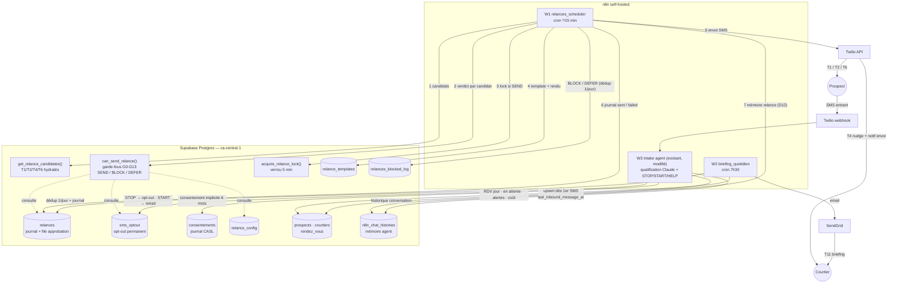

# SPEC — Système de relance automatisée Klaris

**Version** : 1.1 — 2026-06-10
**Statut** : prête pour développement (Sprint 2)
**Implémentation DB** : [`010_relances_system.sql`](../../010_relances_system.sql) (racine du repo)
**Audience** : Dennis (dev), Eliot (review), Joanel (validation UAT)

Ce document **remplace et consolide** les sources antérieures qui se contredisaient :
`docs/relances-decision-matrix.md` (v1.1), `sprint-2/backlog-sprint-2.md` (cadences périmées),
`docs/templates-sms-specifications.md` (v1.2), `docs/templates-sms-figma-extraits.md` (copy de référence),
`mvp_adjointe_ia/SPEC_MVP.md`, `klaris_ios/migrations/003_sprint2_klaris.sql`,
`008_convergence_canonical_schema.sql`. En cas de divergence, **cette spec fait foi**.

---

## 1. Contexte et objectif

Klaris qualifie aujourd'hui les leads SMS entrants (workflow n8n `next_move_intake_agent_v2`,
Twilio → agent Claude → upsert `prospects` → notification courtier). Rien ne relance un lead
qui décroche, rien ne rappelle un RDV, rien n'alerte le courtier qui laisse refroidir un lead
chaud. C'est le thème entier du Sprint 2 : « Système de relance automatisée — MVP opérationnel ».

Objectifs mesurables (Figma/backlog) :

| Métrique | Avant | Cible |
|---|---|---|
| Relances oubliées / semaine | 3-5 | 0 |
| Prospects perdus faute de suivi | ~30 % | < 10 % |
| Relances T1 envoyées dans la fenêtre légale | — | > 90 % |
| Relances vers numéros opt-out | — | **0** (légal, non négociable) |
| Budget Twilio mensuel | — | < 50 CAD |

---

## 2. Décisions actées

Les docs existants laissaient 14+ conflits ouverts. Cette section les tranche. Chaque décision
est appliquée dans la migration et les workflows ; celles marquées 🔶 restent à confirmer par
Joanel **sans bloquer le dev** (le défaut indiqué est implémenté en attendant).

| # | Conflit | Décision | Justification |
|---|---|---|---|
| D1 | Cadences J+7/14/21 (backlog) vs J+2/J+5 (matrice v1.1 post-Figma) | **J+2 / J+5, T3 supprimé** | La matrice v1.1 est la recalibration la plus récente, validée Figma |
| D2 | T1 générique vs contextuel (documents) | **MVP : variante `defaut` uniquement.** La variante `documents` est seedée mais non sélectionnée (aucun flag fiable « documents en attente » n'existe en DB — `resume_ia` n'existe pas) ; elle servira à T8 `etape_financement` (P2) 🔶 | Le fork Figma reste ouvert côté produit, mais le scheduler doit être déterministe |
| D3 | STOP = 90 jours (G2 matrice) vs permanent (CASL/Loi 25) | **Permanent.** Présence d'une ligne `sms_optout` = opt-out actif ; seul un START explicite du prospect la supprime | Le retrait de consentement n'expire pas légalement ; 90 j = risque d'amende |
| D4 | 3 schémas `relances` divergents + 008 déjà mergé sur main | **Canonique = forme 008/iOS étendue** : colonnes `status` (EN), `scheduled_for`, `sent_at`, `content` conservées ; `step` renommé `type_relance` (CHECK élargi aux 11 types) ; statuts `pending / awaiting_approval / sent / skipped / stopped / failed`. La vue `relances_enriched` expose un alias `step` pour la compat iOS. La migration détecte et convertit aussi la forme 001 (chaînes sans 008) | 008 a déclaré le schéma iOS canonique et la DB live l'a probablement ; on ne se bat pas contre la prod. Mapping §5.4 |
| D5 | `can_send_relance()` en SQL vs TypeScript/n8n | **PL/pgSQL** (lecture seule, testable en SQL pur, une seule source de vérité pour T1/T2/T4/T6) | n8n ne fait qu'appeler `SELECT can_send_relance(...)` |
| D6 | Envoi auto vs approbation courtier | **Auto par défaut** ; `courtiers.mode_approbation_relances = true` → ligne `awaiting_approval`, le courtier approuve (→ `pending` + `approved_at`) ou refuse (→ `skipped`), le cron suivant envoie les `pending` approuvées | Pattern persona « chaque action IA traçable + réversible », JP exige l'option |
| D7 | Rappel RDV à 18h (matrice) vs 10h (exemple Figma) | **J-1, fenêtre 17h-19h locale** 🔶 | La matrice est prescriptive, l'exemple Figma illustratif |
| D8 | Envoi dimanche (O3 jamais validé) | **Relances commerciales bloquées le dimanche** → report lundi 11h. Samedi permis 10h-18h. Les rappels RDV (transactionnels) partent 7j/7 (D21) 🔶 | Défaut conservateur |
| D9 | Timezone prospect inexistante | Colonne `prospects.timezone` DEFAULT `'America/Montreal'` | 100 % du marché MVP est le Grand Montréal |
| D10 | Budget 500 CAD (pseudo-code) vs 35-50 CAD (Figma) | **Cap 50 CAD/mois**, alerte à 80 % (40 CAD), coût unitaire 0,015 CAD/SMS en config | Figma = valeur validée la plus récente |
| D11 | Signature « NextMove pour X » (CASL C1) vs « l'assistante de Joanel » (Figma) | **« C'est l'assistante de {{courtier_prenom}} »**. L'expéditeur légal est le courtier ; nom complet + tél via HELP. Aucune marque dans la copy prospect. ⚠️ **Risque accepté à faire valider juridiquement** : CASL exige normalement nom + adresse postale + contact dans chaque MEC (ou lien facilement accessible) — le format SMS ne le permet pas ; prévoir une URL courte vers une page d'identification complète (post-MVP) 🔶 | Marque invisible = convention Figma non négociable ; §9 ne prétend pas à la conformité totale |
| D12 | Relance absente de la mémoire conversationnelle | Chaque relance prospect envoyée est **insérée dans `n8n_chat_histories`** (message rôle `ai`, session = téléphone). Contrat JSONB exact : §7.1 nœud 12 | Sinon l'agent de qualification ne sait pas qu'une relance est partie quand le prospect répond |
| D13 | Passage à `perdu` (l'ancienne règle dépendait de T3, supprimé) | **Pas de passage automatique au MVP.** `perdu` = action manuelle courtier 🔶 | Marquer perdu trop tôt tue la réactivation T9 (P3) |
| D14 | Les leads abandonnés mi-conversation n'ont pas de ligne `prospects` | L'intake **upsert le prospect dès le 1er SMS entrant** (statut `en_qualification`) + `last_inbound_message_at` à chaque message. La migration rend `type_projet` nullable (inconnu au 1er message). Cible de conflit : `ON CONFLICT (courtier_id, telephone) WHERE telephone IS NOT NULL` (index unique posé par 008) | Sans ligne prospect, T1/T2 n'ont rien à requêter |
| D15 | SQL par interpolation de chaîne dans l'intake (`Build Upsert Query`) | **Interdit.** Toute requête n8n = `$1…$n` + `queryReplacement`. La réécriture du nœud existant fait partie du sprint | Suite du fix SQLi (PR #24/#25) |
| D16 | STOP non persisté (trou légal actuel) + consentement | Branche STOP de l'intake → upsert `sms_optout` + `prospects.opted_out_at` + accusé < 60 s. START → DELETE `sms_optout` + consentement explicite journalisé. **Consentement implicite d'un SMS entrant (demande de renseignements) = 6 mois** (CASL art. 10(9)b)), pas 2 ans — 2 ans seulement après transaction | CASL : opt-out fonctionnel obligatoire ; aujourd'hui STOP n'écrit RIEN |
| D17 | Encodage : templates Figma accentués vs convention repo « sans accents » | **GSM-7 strict, sans accents, ≤ 160 caractères pire-cas** (prénom prospect 14 ch, prénom courtier 11 ch). Vérifié : tous les seeds passent (max 140 ch). Copy Figma raccourcie en conséquence — à re-valider Joanel (Q2) | `ê`, `ç`, `î` basculent le SMS en UCS-2 (70 chars) |
| D18 | T4 par push+email (backlog) sans infra push | **MVP : SMS au courtier** (Twilio déjà en place). Push = P2 | Zéro nouvelle infra |
| D19 | EN-CA « non négociable » (personas) vs « post-MVP » (spec) | **Post-MVP confirmé.** Prospect anglophone sans template EN → **BLOCK G10 + nudge courtier** (jamais de FR forcé) | Pire qu'un non-envoi : un envoi dans la mauvaise langue |
| D20 | Éligibilité T1/T2 | **T1/T2 = statuts `nouveau` + `en_qualification` uniquement.** Lead `qualifie` = responsabilité courtier (couvert par T4). T4 ajoute aussi « aucun RDV créé » à la condition matrice 🔶 | La relance auto sur un lead que le courtier travaille créerait des doublons de voix |
| D21 | Rappels RDV vs fenêtres d'envoi (un RDV samedi → rappel vendredi 17-19h interdit par la règle « vendredi ≤ 16h » ; RDV lundi → rappel dimanche bloqué) | **Les types `rdv_rappel_*` et `post_rdv_feedback` sont transactionnels : exempts de G4 (humain actif) et de la fenêtre prospect G8/G9.** Leur créneau (veille 17h-19h locale) est imposé par les candidats T6, 7j/7 | Un rappel de RDV demandé par le prospect n'est pas un message commercial ; sans exemption, les RDV du samedi et du lundi n'auraient jamais de rappel |
| D22 | Mention STOP « 1er message puis tous les 3 » (spec templates) vs CASL | **Mention STOP inline dans CHAQUE SMS commercial** (T1, T2 — intégrée aux templates, pas d'append dynamique). T6 transactionnel sans STOP (à valider juridiquement, cf. D11) | CASL art. 6(2)c) exige le mécanisme de désabonnement dans chaque MEC, pas 1 sur 3 |
| D23 | Stock historique au lancement | **Aucun backfill de `last_inbound_message_at`** (n8n_chat_histories n'a pas de timestamp). NULL = exclu de T1/T2. Relancer le stock = décision explicite de Joanel avec vérif consentement préalable | Un backfill à `now()` aurait déclenché un envoi de masse à H+48 vers des leads morts au consentement potentiellement expiré |

---

## 3. Périmètre

### P0 — MVP Sprint 2 (cette spec, à livrer)

| Trigger | Destinataire | Canal | Condition | Quand |
|---|---|---|---|---|
| **T1** `inactif_j2` | Prospect | SMS | Dernier message prospect ≥ 48 h (et < 7 j), statut `nouveau`/`en_qualification` | Au premier créneau légal |
| **T2** `inactif_j5` | Prospect | SMS | ≥ 120 h (et < 14 j), T1 envoyée et restée sans réponse | Idem |
| **T4** `nudge_courtier_chaud` | Courtier | SMS | `score_chaleur ≥ 7`, statut `qualifie`, aucune action courtier > 24 h, aucun RDV créé | 6h-22h, 7j/7, max 3× / cadence 48 h |
| **T6** `rdv_rappel_j1` | Prospect | SMS | RDV `confirme` demain (heure locale) | Veille, 17h-19h, 7j/7. Simple rappel, **pas** de OUI/NON |
| **T11** `briefing_quotidien` | Courtier | Email (+SMS si activé) | Tous les jours | 7h30 locale courtier |
| — | Prospect | SMS | Mots-clés STOP/ARRET/STOPPER/UNSUBSCRIBE, START, HELP | Temps réel (intake), accusé < 60 s |

### P2 / P3 — hors périmètre (schéma déjà prêt, ne pas implémenter)

T5 `nudge_courtier_urgent` (score ≥ 9, > 4 h), T6bis `rdv_rappel_j7`, T7 `post_rdv_feedback` (H+24),
T8 `etape_financement`, T9 `reactivation_longterme` (email, opt-in explicite obligatoire),
T10 `anniversaire`, templates EN-CA, A/B testing, mesure auto du sender score (G12 = flag manuel
au MVP), Google Calendar, push PWA, page web d'identification CASL complète (D11).

**Séquence prospect : T1 → T2, puis silence.** Toute réponse du prospect annule et réinitialise
la séquence (mécanique : la réponse met à jour `last_inbound_message_at`, ce qui invalide les
candidats T1/T2, déclenche G4 et remet le compteur G7 à zéro).

---

## 4. Architecture

Principes :

- **Scheduler stateless.** Chaque run du cron recalcule les candidats depuis l'état des
  données. `relances` est un **journal** (+ file d'approbation en mode D6), pas une queue.
  Un DEFER n'écrit rien — le run suivant retombe sur le candidat. Idempotence garantie par
  les `NOT EXISTS` des candidats, l'index unique par RDV et le verrou applicatif 5 min.
- **Garde-fous des messages prospect/courtier dans une fonction SQL** (`can_send_relance`),
  testable sans n8n. Le briefing T11 (sans prospect) est gardé par W2 (§7.2).
- **Écritures runtime via service_role uniquement** (n8n). Posture RLS alignée sur
  `009_security_lockdown_anon.sql` : `anon` n'a accès à rien.
- Horodatage **UTC en base**, conversions locales via `prospects.timezone` / `courtiers.timezone`.
- **Config d'environnement n8n** (à poser avant la recette) : `TWILIO_FROM_NUMBER` (le
  workflow intake utilise des placeholders `+1XXXXXXXXXX` — le vrai numéro vit dans
  l'instance n8n), `SENDGRID_FROM_EMAIL` + credential SendGrid (à créer : aucun n'existe),
  `RELANCES_DRY_RUN`.

---

## 5. Modèle de données

DDL complet : [`010_relances_system.sql`](../../010_relances_system.sql). La migration gère
les **deux formes de départ** de `relances` (001 française, ou 008/iOS si la convergence a
tourné — c'est le cas probable de la DB live) et échoue explicitement sur une forme inconnue.
Exécuter via le **rôle admin propriétaire des tables** (`postgres` sur Supabase, qui a
BYPASSRLS — les UPDATE de données doivent bypasser RLS). La migration est **ré-exécutable**.

### 5.1 Nouvelles tables

| Table | Rôle | Points clés |
|---|---|---|
| `relance_config` | Constantes ajustables sans migration | cadences, fenêtres, fériés QC 2026 (⚠️ à régénérer chaque année), budget, kill switch `relance_active` (fail-closed) |
| `sms_optout` | Opt-out **permanent** (store unique, créé par 008, recréé si absent) | `telephone UNIQUE` ; présence = opt-out ; START supprime la ligne ; helper `is_phone_optout()` |
| `consentements` | Journal CASL | `type` implicite/explicite, `source`, `capture_at`, `expires_at` (**sms_inbound : +6 mois** ; transaction : +2 ans) |
| `relance_templates` | Corps des messages | clé `(type_relance, canal, langue, variante)`, GSM-7 strict |
| `relances_blocked_log` | Journal BLOCK/DEFER | `garde` (G0..G13), `reason`, `retry_at` — audit + tuning |
| `rendez_vous` | Version minimale pour T6 | échec explicite si une variante incompatible préexiste ; défauts choisis parmi les Q1-Q8 de `rendez_vous-table-spec.md` 🔶 |

### 5.2 Colonnes ajoutées

- `prospects` : `last_inbound_message_at` (maintenue par l'intake — **pas de backfill**, D23),
  `last_courtier_action_at`, `pause_relances`, `opted_out_at`, `timezone`,
  `relances_lock_until`, `deleted_at` (si absent) ; `type_projet` devient **nullable** (D14).
- `courtiers` : `timezone`, `pause_relances`, `mode_approbation_relances`,
  `briefing_email`, `briefing_sms`.

### 5.3 Table `relances` (canonique)

Colonnes : `id`, `prospect_id` (**nullable** — briefing), `courtier_id` (backfillé),
`rendez_vous_id`, `type_relance`, `status`, `scheduled_for` (DEFAULT now()), `sent_at`,
`content`, `canal`, `langue`, `template_id`, `twilio_sid`, `error_detail`,
`approved_at`, `approved_by`, `skipped_at`, `deleted_at`, `created_at`, `updated_at`.

Types : `inactif_j2`, `inactif_j5`, `nudge_courtier_chaud`, `nudge_courtier_urgent`,
`rdv_rappel_j1`, `rdv_rappel_j7`, `post_rdv_feedback`, `etape_financement`,
`reactivation_longterme`, `anniversaire`, `briefing_quotidien`.
Statuts : `pending`, `awaiting_approval`, `sent`, `skipped`, `stopped`, `failed`.
Contrainte : `status='sent'` ⇒ `sent_at` non nul (les gardes G6/G11/G13 filtrent dessus).

La migration mappe les anciennes valeurs : 008 (`j2/j5/j10` → `inactif_j2/inactif_j5/
reactivation_longterme`) et 001 (`rappel_documents` → `etape_financement`, etc. ;
`planifiee/envoyee/annulee` → `pending/sent/skipped`).

Le **compteur de tentatives est dérivé** (COUNT sur `relances`), jamais stocké.

### 5.4 Compatibilité iOS

L'app iOS lit `status`, `scheduled_for`, `sent_at`, `approved_at` **inchangés**. Seul `step`
disparaît de la table : la vue `relances_enriched` (recréée `security_invoker=on`) expose
`step` en alias calculé (`inactif_j2`→`j2`, `inactif_j5`→`j5`, `reactivation_longterme`→`j10`).
Migrer l'app vers `type_relance` à terme.

### 5.5 RLS

- `anon` : **aucun accès** — REVOKE explicite sur toutes les nouvelles tables, la vue
  `relances_enriched` (recréée après le revoke global de 009, donc re-revoquée) et
  l'EXECUTE des fonctions (`is_phone_optout` ne doit pas servir d'oracle d'opt-out).
- `authenticated` (courtier, `courtiers.id = auth.uid()`) : SELECT sur ses `relances`
  (policy robuste : `courtier_id` direct OU via `prospects`), `rendez_vous`,
  `relances_blocked_log`, `relance_templates`, `sms_optout` (vérification anti-CASL) ;
  UPDATE sur `relances` **limité par grant de colonnes** à
  (`status`, `approved_at`, `approved_by`, `skipped_at`) et par policy à l'approbation de
  SES lignes `awaiting_approval` (WITH CHECK ré-affirme `courtier_id = auth.uid()` —
  pas de réassignation possible).
- `consentements`, `relance_config` : service_role uniquement.

---

## 6. Garde-fous G0-G13

Implémentés dans `can_send_relance(prospect_id, type, canal, rendez_vous_id)` → JSONB
`{action: SEND|BLOCK|DEFER, garde, reason, retry_at}`. **Ordre strict, première règle qui
matche gagne.** Fonction en lecture seule : le scheduler journalise les BLOCK/DEFER.
Couvre T1/T2/T4/T6 (+ types P2/P3) ; **pas** le briefing T11 (gardé par W2, §7.2) — la
fonction le BLOCK explicitement si appelée avec ce type.

| # | Règle | Action | Notes |
|---|---|---|---|
| G0 | Kill switch `relance_active` (fail-closed : config absente = bloqué), prospect introuvable ou soft-deleted, type briefing | BLOCK | |
| G1 | Téléphone dans `sms_optout` | BLOCK | Permanent (D3) |
| G2 | `prospects.opted_out_at` non nul | BLOCK | Défense en profondeur, levé par START |
| G3 | Statut `perdu` ou `conclu` (sauf T9) | BLOCK | |
| G4 | Message prospect < 24 h (`human_active`) | BLOCK | **Exemption : types RDV** (D21) |
| G5 | `pause_relances` (prospect **ou** courtier) | BLOCK | |
| G6 | Cadence min du type non écoulée | BLOCK | Config `cadence_min_heures` |
| G7 | Tentatives ≥ max du type | BLOCK | Par RDV pour les types RDV ; sinon comptées **depuis le dernier message prospect** (une réponse réinitialise) |
| G8 | Hors fenêtre d'envoi | DEFER | Prospect : `relance_next_slot()` (§6.1), **types RDV exempts** (D21). Courtier : 6h-22h, retry +2 h |
| G9 | Férié QC (jour courant, heure locale prospect) | DEFER | Vérifié avant G8 pour les messages prospect (label `G9` dans les logs) ; `relance_next_slot()` saute aussi les fériés dans le calcul du `retry_at`. **Les nudges courtier partent 7j/7, fériés compris** |
| G10 | Template `(type, canal, langue)` actif manquant | BLOCK | Anglophone sans template EN → BLOCK + nudge courtier (D19, nœud 5a) |
| G11 | Coût SMS du mois ≥ 50 CAD | BLOCK | + alerte admin. Coût = COUNT(sent du mois) × 0,015. ⚠️ ne compte que les relances (les SMS de l'agent intake ne sont pas mesurés au MVP) |
| G12 | `sender_score_ok = false` | DEFER +2 h | Flag **manuel** au MVP ; absence de config = ok |
| G13 | ≥ 2 relances prospect (tous types) < 48 h | BLOCK | Anti-harcèlement, types courtier exclus du compte |

G1-G4, G9 et G13 ne s'appliquent qu'aux messages **prospect** ; G5-G8 et G10-G12 aux deux
(fenêtres distinctes pour G8).

### 6.1 `relance_next_slot(tz, from)` — algorithme déterministe

1. Avant 8 h locale → même jour 9 h ; après 20 h → lendemain 9 h.
2. Puis en boucle : férié QC → lendemain 9 h ; **dimanche → lundi** (la règle « lundi 11 h »
   s'applique ensuite) ; lundi avant 11 h → lundi 11 h ; vendredi après 16 h → samedi 10 h ;
   samedi hors 10h-18h → clamp/lendemain.
3. Garde-fou : exception si aucun créneau sous 30 jours.

La « golden hour » (mar-jeu 10h-12h) est **consultative, pas un garde-fou** : hypothèse à
valider avec les données de Joanel avant de l'imposer.

---

## 7. Workflows n8n

Conventions communes : credentials existants (`Twilio Eliot account` `mgpqsMa0wm6Pq6XS`,
`Supabase Postgres - Next Move` `j8tW7NxEVFbEQLqS`, `Anthropic account` `A3nrWWi6DBLCLA61` ;
**SendGrid : à créer**), `errorWorkflow: 4jPCKbGJ2Z55gNjF`, **toute requête SQL paramétrée**
(`$1…$n` + `options.queryReplacement` — jamais d'interpolation), noms de nœuds snake_case,
numéro émetteur via env `TWILIO_FROM_NUMBER`.

### 7.1 W1 — `relances_scheduler` (nouveau)

| # | Nœud | Type | Détail |
|---|---|---|---|
| 1 | `cron_15min` | Schedule Trigger | `*/15 * * * *` |
| 2 | `get_candidates` | Postgres | `SELECT * FROM get_relance_candidates();` — **lignes déjà hydratées** (téléphones, prénoms, `mode_approbation`, `rdv_heure`, `score_chaleur`, `heures_sans_action`) |
| 2b | `get_approved` | Postgres | `SELECT r.id AS relance_id, r.prospect_id, r.courtier_id, r.rendez_vous_id, r.type_relance, r.canal, r.langue, r.content, p.telephone AS destinataire_tel FROM relances r JOIN prospects p ON p.id=r.prospect_id WHERE r.status='pending' AND r.approved_at IS NOT NULL AND r.deleted_at IS NULL` — le `content` a été rendu **au moment de la mise en attente** (nœud 9) : pas de re-rendu. `relance_id` non nul = marqueur « approuvée » |
| 2c | `merge_items` | Merge (append) | Fusionne 2 et 2b |
| 3 | `loop_candidates` | Split In Batches | taille 1 (volume MVP : 10-20 prospects) |
| 4 | `check_guards` | Postgres | `SELECT can_send_relance($1,$2,$3,$4) AS verdict;` |
| 5 | `route_action` | Switch | sur `verdict.action` |
| 5a | BLOCK/DEFER → `log_blocked` | Postgres | INSERT paramétré **dédupliqué** : `INSERT INTO relances_blocked_log (...) SELECT $1,... WHERE NOT EXISTS (SELECT 1 FROM relances_blocked_log WHERE prospect_id=$1 AND type_relance=$2 AND garde=$3 AND created_at::date = now()::date)` (évite ~96 lignes/jour par candidat coincé). Si garde = G10 (anglophone) ou G11 → SMS de nudge courtier/admin |
| 6 | SEND → `acquire_lock` | Postgres | `SELECT acquire_relance_lock($1) AS locked;` — **`locked` vaut toujours true/false** ; false → skip (un autre run a le verrou) |
| 7 | `select_template` | Postgres | **Items de 2 uniquement** (2b a déjà son `content`) : `SELECT id, corps FROM relance_templates WHERE type_relance=$1 AND canal=$2 AND langue=$3 AND variante='defaut' AND actif` (D2 : variante `defaut` seule au MVP) |
| 8 | `render_message` | Code | **Items de 2 uniquement.** Injection `{{variables}}` depuis l'item hydraté. Variable requise manquante → route 5a avec reason `variable_manquante`. **Pas d'append STOP** (D22 : mention inline dans les templates). Assert final : GSM-7 + ≤ 160 chars sinon route 5a `template_invalide` |
| 9 | `mode_approbation` | IF | **Items de 2 uniquement**, si `mode_approbation = true` : INSERT `relances` (status `awaiting_approval`, avec `template_id` + `content` rendus aux nœuds 7-8 — le courtier prévisualise le message exact) + SMS nudge courtier, fin de branche |
| 10 | `send_twilio` | Twilio | `from` = env `TWILIO_FROM_NUMBER` ; `to` = `destinataire_tel` ; retry 1× après 2 s si échec. **Erreur Twilio 21610** (destinataire opt-out côté Twilio) → upsert `sms_optout` (source `bounce`) au lieu d'un simple échec |
| 11 | `journal_relance` | Postgres | Item de 2 : `INSERT INTO relances (prospect_id, courtier_id, rendez_vous_id, type_relance, canal, langue, template_id, content, status, scheduled_for, sent_at, twilio_sid, error_detail) VALUES ($1..$13)` avec `status='sent'|'failed'`, `scheduled_for=now()`, `sent_at=now()` si sent, `content`=message rendu. Item de 2b : `UPDATE relances SET status='sent'|'failed', sent_at=now(), twilio_sid=$2, error_detail=$3 WHERE id=$1` (consomme la ligne approuvée — jamais de doublon) |
| 12 | `memoire_agent` | Postgres | Si destinataire = prospect : `INSERT INTO n8n_chat_histories (session_id, message) VALUES ($1, $2::jsonb)` avec `session_id` = **la valeur E.164 brute `data.from` de Twilio** (clé de session de l'intake) et `message` = `{"type":"ai","data":{"content":"<sms rendu>","additional_kwargs":{},"response_metadata":{},"tool_calls":[],"invalid_tool_calls":[]}}` — ⚠️ **contrat à confirmer en copiant une ligne réelle produite par le nœud memoryPostgresChat de l'instance n8n cible avant d'implémenter** (une forme erronée casse la mémoire de l'agent pour ce prospect) ; étape de recette dédiée §11 |
| 13 | `notify_courtier` | Twilio | Si relance prospect envoyée : SMS courtier « Klaris a relance {{prospect_prenom}} ({{type}}) » (principe : silencieux par défaut, jamais invisible) |
| 14 | `alert_admin` | IF + Twilio | 2 échecs consécutifs → alerte admin. Après chaque envoi : si coût du mois ≥ 80 % du cap (40 CAD) → alerte budget (dédupliquée à 1/jour via `relances_blocked_log`, garde `G11-80`) |

Refus d'une relance en attente (iOS/dashboard) : `UPDATE relances SET status='skipped',
skipped_at=now()` — `skipped_at` non nul distingue le refus courtier d'un skip de dry-run,
et les candidats T1/T2 excluent ces lignes : **une relance refusée n'est jamais reproposée**
pour le même cycle d'inactivité.

Pas de délai « humanisation » (`Delai Humain`) : une relance planifiée n'est pas une réponse,
le pattern anti-bot de l'intake ne s'applique pas.

**Mode DRY_RUN** : env n8n `RELANCES_DRY_RUN=true` → nœud 10 court-circuité, journal écrit
`status='skipped'`, `error_detail='dry_run'`. Obligatoire pour la recette.

### 7.2 W2 — `briefing_quotidien` (nouveau)

Cron `30 7 * * *` (TZ courtier ; un seul courtier au MVP). Requêtes paramétrées :
RDV du jour (`rendez_vous` confirmés, jour local), en attente (prospects `en_qualification`
avec ancienneté `last_inbound_message_at`), alertes (leads `score_chaleur ≥ 7` sans action
> 24 h), nouveaux prospects depuis la veille, coût SMS du mois. Rendu via templates
`briefing_quotidien` (`email` + variante `sms` compacte si `courtiers.briefing_sms`).
Envoi SendGrid (credential + `SENDGRID_FROM_EMAIL` à créer).

W2 **n'appelle pas** `can_send_relance` (pas de prospect associé) : ses garde-fous sont
`relance_active` (fail-closed), `courtiers.pause_relances`, et la déduplication « déjà envoyé
aujourd'hui » (`SELECT 1 FROM relances WHERE type_relance='briefing_quotidien' AND
courtier_id=$1 AND sent_at >= date_trunc('day', now() AT TIME ZONE $2)`). Journalisé dans
`relances` avec `prospect_id NULL` + `courtier_id` posé (sinon la ligne est invisible en RLS).

### 7.3 W3 — modifications de `next_move_intake_agent_v2` (existant)

| # | Modification | Pourquoi |
|---|---|---|
| M1 | Après le trigger Twilio : upsert paramétré `prospects` dès le **1er message** — `INSERT INTO prospects (courtier_id, canal_source, statut, telephone, last_inbound_message_at) VALUES ($1,'sms','en_qualification',$2,now()) ON CONFLICT (courtier_id, telephone) WHERE telephone IS NOT NULL DO UPDATE SET last_inbound_message_at = now()` (cible = index unique posé par 008 ; ⚠️ vérifier qu'il existe sur la DB live). + INSERT `consentements` (implicite, `sms_inbound`, **expires_at = now() + 6 mois**, D16) si premier contact | D14, D16 — sans ça T1/T2 sont aveugles |
| M2 | Branche `Filtre STOP` : étendre les mots-clés à `stop, arret, arrêt, stopper, unsubscribe` (trim + lower) ; **upsert** `sms_optout` — `INSERT ... ON CONFLICT (telephone) DO UPDATE SET reason='stop_keyword', created_at=now()` (un STOP→START→STOP ne doit JAMAIS échouer) + `UPDATE prospects SET opted_out_at=now()` **avant** l'accusé (< 60 s) ; accusé = template `systeme/stop_ack` + UPDATE `consentements SET revoked_at=now()` | Trou légal actuel : STOP n'écrit rien |
| M3 | Nouvelle branche `START` : `DELETE FROM sms_optout WHERE telephone=$1`, `UPDATE prospects SET opted_out_at=NULL`, INSERT `consentements` (explicite, `sms_start`) | Ré-opt-in |
| M4 | Nouvelle branche `HELP` : répondre template `systeme/help` (identification CASL : nom complet courtier + tél) | CASL |
| M5 | Réécrire `Build Upsert Query`/`Execute Upsert` en requête paramétrée, avec la même cible de conflit que M1 | D15 — dette SQLi restante |

La réponse d'un prospect à une relance ne nécessite **aucun parsing dédié** (pas de mot-clé
CONTINUER — il mourait avec T3) : le message entre dans le flux normal de l'agent, qui a le
contexte grâce à D12, et `last_inbound_message_at` réinitialise la séquence.

---

## 8. Templates et variables

Textes seedés par la migration (§14 du SQL), source copy = Figma 62:2 adaptée GSM-7 + budget
longueur (D17, D22 — **vérifiés ≤ 160 pire-cas**, prénoms 14/11 ch). Conventions **non
négociables** : signature « C'est l'assistante de {{courtier_prenom}} » (jamais « NextMove »,
jamais « Klaris » côté prospect), français québécois chaleureux, 1 question par message,
prénom du prospect en ouverture, jamais de fausse urgence, jamais de MAJUSCULES (sauf alerte
courtier), mention STOP inline dans chaque SMS commercial.

Variables disponibles (toutes fournies par `get_relance_candidates()` — le moteur de rendu
**route en BLOCK** si une variable requise manque) :

| Variable | Source | Requise |
|---|---|---|
| `{{prospect_prenom}}`, `{{prospect_nom}}`, `{{prospect_tel}}` | candidats | T1/T2/T6 : prenom ; T4 : les trois |
| `{{courtier_prenom}}`, `{{courtier_tel}}` | candidats | oui |
| `{{courtier_nom_complet}}` | concaténé par le rendu (`courtier_prenom || ' ' || courtier_nom`) — utilisé par le template `help` (intake) uniquement | non |
| `{{rdv_heure}}`, `{{rdv_lieu}}` | candidats (heure locale prospect, format `18h` / `18h30`) | T6 : heure |
| `{{score_chaleur}}`, `{{heures_sans_action}}` | candidats (formule : `FLOOR(EXTRACT(EPOCH FROM now() - COALESCE(last_courtier_action_at, updated_at))/3600)`) | T4 : oui |
| `{{rdv_du_jour}}`, `{{en_attente}}`, `{{alertes}}`, `{{nb_nouveaux}}`, `{{nb_rdv}}`, `{{nb_attente}}`, `{{nb_alertes}}`, `{{date_locale}}`, `{{br}}` (saut de ligne email) | requêtes W2 — rendu assuré par W2, pas par W1 | T11 : oui |

Templates système (légaux, type `systeme`, utilisés par l'intake uniquement) : `stop_ack`,
`help`. Pas de template EN-CA au MVP (D19 : BLOCK G10 + nudge plutôt que FR forcé).

---

## 9. Conformité

| Exigence | Implémentation | Statut |
|---|---|---|
| **CASL** — mécanisme de désabonnement dans chaque MEC | Mention STOP inline dans chaque SMS commercial (T1/T2, D22) ; T6 classé transactionnel sans STOP | ✅ / 🔶 classification T6 à valider juridiquement |
| **CASL** — identification expéditeur | Courtier identifié dans chaque message (signature) ; nom complet + tél via HELP | ⚠️ adresse postale absente (impossible en 160 ch) — **risque accepté, validation juridique requise** (D11) ; URL d'identification = post-MVP |
| **CASL** — opt-out fonctionnel | STOP temps réel intake (M2, upsert robuste au double-STOP), accusé < 60 s, `sms_optout` permanent, G1/G2 + erreur Twilio 21610 → opt-out | ✅ |
| **CASL** — consentement documenté | Table `consentements` (timestamp + source) ; implicite au 1er contact entrant, **expire +6 mois** (demande de renseignements, art. 10(9)b)) | ✅ ; enforcement automatique de l'expiration = P2 (volume MVP : T1/T2 partent à J+2/J+5, largement sous 6 mois) |
| **CASL** — délai opt-out ≤ 10 jours ouvrables (art. 11) | Temps réel (consultation `sms_optout` à chaque envoi) | ✅ |
| **Loi 25** — hébergement | Supabase ca-central-1 (inchangé) | ✅ |
| **Loi 25** — finalité au 1er contact (L3) + droits d'accès/rectification (L4) | Non couverts par cette spec | 🔶 post-MVP, à tracer au backlog |
| **Loi 25** — minimisation logs | Aucun PII prospect dans les logs n8n (masquer téléphone : 4 derniers chiffres) | ✅ règle de dev |
| **Twilio** — mots-clés | STOP/ARRET/STOPPER/UNSUBSCRIBE + START + HELP (M2-M4) | ✅ |
| **Twilio** — volume | < 100 SMS/min inatteignable au volume MVP (50-100 SMS/mois) ; G11 plafonne | ✅ |
| **OACIQ** — imputabilité | L'IA ne décide jamais : triggers déterministes, mode approbation optionnel (D6), tout envoi journalisé (`relances.content` conservé) + courtier notifié (nœud 13), audit BLOCK/DEFER | ✅ conçu conforme ; reconnaissance OACIQ visée, pas acquise |
| Fenêtres horaires | G8/G9 + `relance_next_slot` : 8h-20h locale, fériés QC, dimanche bloqué, lundi ≥ 11 h, vendredi ≤ 16 h ; rappels RDV exempts (D21) | ✅ |

---

## 10. Observabilité et gestion d'erreurs

- **Échec Twilio** : retry 1× après 2 s → `relances.status='failed'` + `error_detail` ;
  erreur 21610 → opt-out (nœud 10) ; 2 échecs consécutifs → alerte admin.
  `errorWorkflow 4jPCKbGJ2Z55gNjF` en filet global.
- **Budget** : G11 bloque au cap ; alerte à 80 % (40 CAD) après envoi, dédupliquée 1/jour ;
  coût du mois affiché dans le briefing W2.
- **Tableaux de bord** : `relances_blocked_log` (taux de BLOCK par garde = tuning ; logs
  dédupliqués par jour), `relances` par statut/type/jour. Requêtes de monitoring : backlog US-10.
- **SLA scheduler** : > 99 % (1 cron raté toléré — le run suivant rattrape, conception stateless).
- **Maintenance annuelle** : régénérer `relance_config.jours_feries_qc` (liste 2026 seedée).

---

## 11. Critères d'acceptation et plan de test

### Tests SQL (pgTAP ou script psql, sur DB de staging — appliquer 010 d'abord)

`can_send_relance` — 1 cas par garde minimum :

1. G0 : `relance_active=false` → BLOCK ; **ligne config supprimée → BLOCK aussi** (fail-closed) ; type briefing → BLOCK.
2. G1 : téléphone dans `sms_optout` → BLOCK ; après DELETE (START) → SEND.
3. G2 : `opted_out_at` non nul → BLOCK.
4. G3 : statut `perdu` → BLOCK ; `conclu` → BLOCK.
5. G4 : message prospect il y a 2 h → BLOCK `human_active` ; **T6 exempté** → SEND.
6. G5 : pause prospect → BLOCK ; pause courtier → BLOCK (y compris nudges T4).
7. G6/G7 : T1 envoyée il y a 3 j sans réponse → G7 BLOCK (max 1 depuis dernier message). Réponse prospect après T1, attendre > 120 h (cadence G6) → nouveau cycle T1 SEND. (G6 et G7 interagissent : le reset G7 ne lève pas la cadence G6 du même type.)
8. G8 : 21 h locale → DEFER lendemain 9 h ; vendredi 17 h → DEFER samedi 10 h ; samedi 19 h → DEFER dimanche→lundi 11 h ; **T6 vendredi 17h30 → SEND** (exemption D21).
9. G9 : 2026-06-24 (St-Jean) → DEFER 2026-06-25 9 h.
10. G10 : `langue_preferee='en'` sans template EN → BLOCK `template_manquant`.
11. G11 : 3 334 relances `sent` simulées ce mois (> 50 CAD) → BLOCK.
12. G12 : `sender_score_ok=false` → DEFER +2 h ; ligne absente → pas de blocage.
13. G13 : 2 relances `sent` en 47 h → BLOCK la 3ᵉ.
14. `get_relance_candidates` : matrice T1/T2/T4/T6 — T2 absent si T1 non envoyée ; T6 absent si rappel déjà `sent` pour ce RDV ; T6 présent un dimanche (RDV lundi) ; T4 absent si RDV `propose`/`confirme` existe ; prospect `deleted_at` → aucun candidat ; `last_inbound_message_at` NULL → aucun candidat T1/T2 (D23).
15. `relance_next_slot` : table de vérité des cas de bord du §6.1 (8 cas).
16. Concurrence : 2 appels `acquire_relance_lock` simultanés → un seul `true`, l'autre **`false` (jamais NULL)**.
17. Migration : ré-exécutable (idempotente) ; depuis forme 008 ET depuis forme 001 (deux DB de test) ; vue `relances_enriched.step` correcte ; rôle exécutant capable de bypasser RLS (`SELECT rolbypassrls FROM pg_roles WHERE rolname=current_user` ou connexion service_role).

### Recette n8n (staging, `RELANCES_DRY_RUN=true` puis numéros internes)

- Bout-en-bout : SMS entrant → ligne `prospects` créée au 1er message (M1) → silence 48 h simulé (manipuler `last_inbound_message_at`) → T1 part dans la fenêtre → **vérifier qu'une ligne `n8n_chat_histories` conforme a été insérée et que l'agent répond avec le contexte de la relance quand le prospect écrit** (D12 — comparer avec une ligne produite par le nœud mémoire avant d'activer) → plus aucune relance (G4/G7).
- STOP → accusé < 60 s → `sms_optout` peuplé → candidat T1 forcé → BLOCK G1 journalisé. START → SEND de nouveau. **STOP→START→STOP** → le second STOP fonctionne (upsert M2).
- Mode approbation : `mode_approbation_relances=true` → ligne `awaiting_approval` → approbation (UPDATE status='pending' + approved_at) → **envoyée au cron suivant via 2b en UPDATE (pas de ligne dupliquée)** ; refus → `skipped`, jamais reproposée.
- T6 : RDV demain 18 h → rappel reçu la veille entre 17 h et 19 h, une seule fois ; **RDV samedi → rappel vendredi 17-19h ; RDV lundi → rappel dimanche 17-19h** (D21).
- T11 : briefing 7h30 reçu (email), variante SMS si activée, pas de doublon si le cron rejoue.

### Definition of Done (backlog Sprint 2)

Tests SQL verts (17 ci-dessus), recette n8n complète, > 90 % des relances dans la fenêtre,
0 envoi vers opt-out, < 5 % de faux positifs `human_active`, budget < 50 CAD, monitoring actif,
UAT Joanel (NPS > 7/10), doc à jour.

---

## 12. Questions ouvertes pour Joanel (défauts appliqués, dev non bloqué)

| # | Question | Défaut implémenté |
|---|---|---|
| Q1 | La relance J+2 générique existe-t-elle, ou seulement la contextuelle documents ? | Générique seule au MVP (D2) ; documents seedée pour P2 |
| Q2 | Textes T1/T2 (jamais validés) + copy Figma raccourcie pour tenir en 160 ch | Propositions seedées §14 du SQL |
| Q3 | Envoi le samedi/dimanche (relances commerciales) | Samedi 10h-18h oui, dimanche non (D8) |
| Q4 | Rappel RDV : veille 17h-19h ou matin du jour J ? | Veille 17h-19h, 7j/7 (D7/D21) |
| Q5 | Mode approbation activé pour le pilote ? | Non (auto) — switch par courtier (D6) |
| Q6 | Passage auto à `perdu` après séquence muette ? | Non, manuel (D13) |
| Q7 | T1/T2 aussi pour les leads `qualifie` ? | Non (D20) |
| Q8 | Emoji (max 1, bascule UCS-2 → 70 chars) | Zéro emoji (GSM-7 strict, D17) |
| Q9 | Flag VIP (exclusion des relances sauf T6) | Non implémenté ; `pause_relances` par prospect couvre le besoin |
| Q10 | Validation juridique : identification CASL sans adresse postale (D11) + classification transactionnelle de T6 (D22) | Risques acceptés documentés §9 |
| Q11 | Relancer le stock historique de leads (pré-migration) ? | Non (D23) — nécessite vérif consentement |

---

## 13. Références

- DDL : [`010_relances_system.sql`](../../010_relances_system.sql)
- Convergence schéma préalable : `008_convergence_canonical_schema.sql` (la migration 010 gère sa présence ou son absence)
- Garde-fous et matrices d'origine : `docs/relances-decision-matrix.md` (v1.1)
- Copy de référence : `docs/templates-sms-figma-extraits.md` (Figma node 62:2)
- Contraintes légales détaillées : `docs/business-constraints-checklist.md` (⚠️ corrigées par D16/D22 : consentement inquiry = 6 mois ; STOP dans chaque MEC ; délai 10 j = CASL, pas Loi 25)
- User stories et monitoring : `sprint-2/backlog-sprint-2.md` (US-1 à US-10 ; cadences obsolètes — cette spec fait foi)
- Spec RDV complète (Q1-Q8) : `docs/rendez_vous-table-spec.md`
- Workflow intake à modifier : `next_move_intake_agent_v2.json` (racine)
