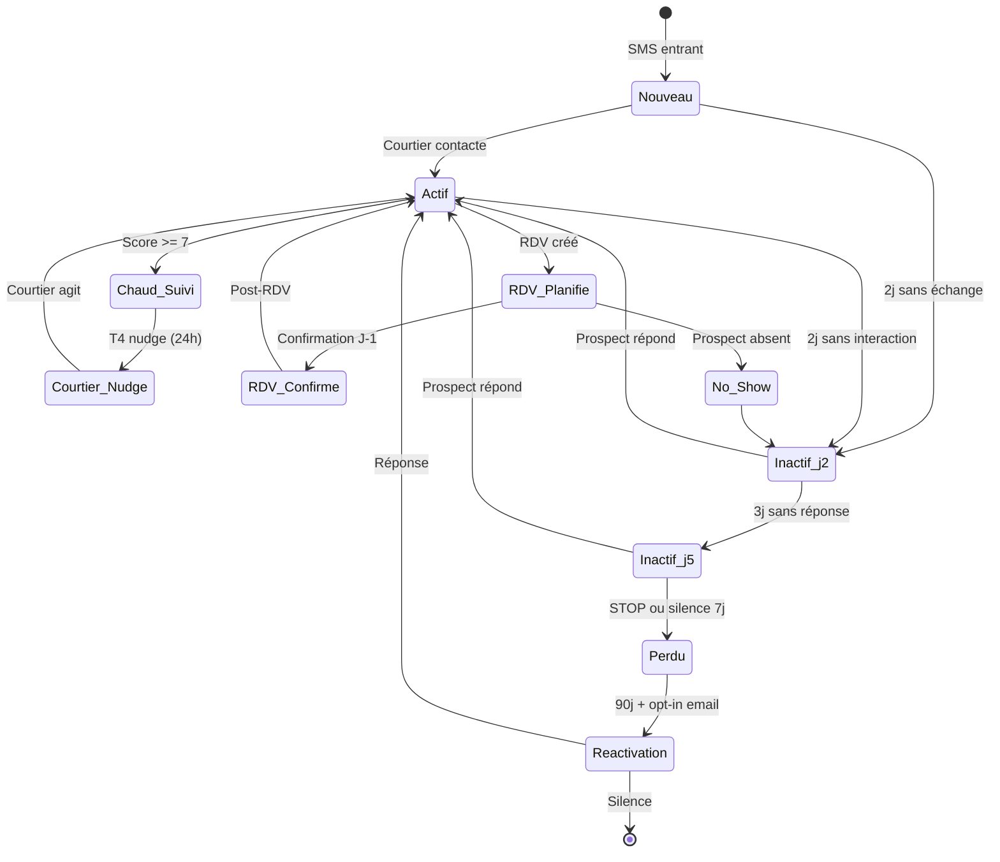
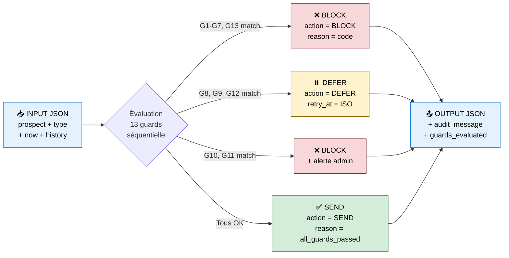
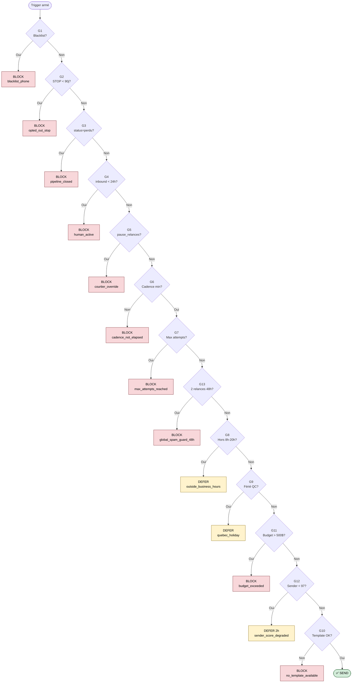
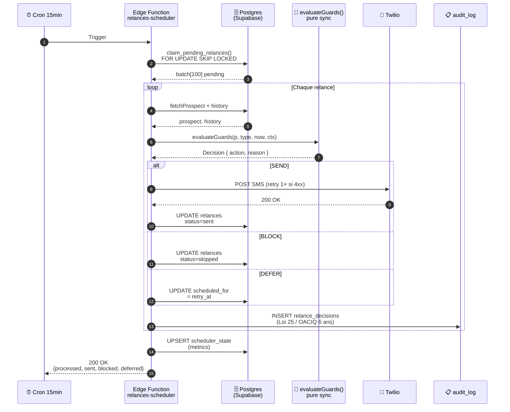

# Klaris — Règles d'affaires Relances (LLM-ready)

> **Usage** : spec consommable par Claude (system prompt n8n / Edge Function).
> **Source** : `docs/relances/relances-decision-matrix.md` v1.1 (post-Figma).
> **Version** : 1.2 — réconciliation drift J+2/J+5 (J+10 retiré).
> **Audience** : Claude Sonnet (orchestrateur) · Claude Haiku (génération template).

---

## SYSTEM PROMPT — Décideur relance

```
Tu es l'orchestrateur de relances Klaris. Ton rôle : décider pour chaque prospect
si une relance doit être envoyée MAINTENANT, BLOQUÉE, ou DIFFÉRÉE.

Tu reçois en input :
- prospect : { id, status, score, last_inbound_at, opted_out_at, pause_relances, locale }
- type_relance demandé : "inactif_j2" | "inactif_j5" | "nudge_courtier_chaud" | "rdv_rappel_j1" | "post_rdv_feedback" | "etape_financement" | "briefing_quotidien"
- now : timestamp UTC actuel
- relances_history : [{ type, sent_at, status }]

Tu retournes EXCLUSIVEMENT un JSON valide :

{
  "action": "SEND" | "BLOCK" | "DEFER",
  "reason": "<code_court>",
  "retry_at": "<ISO timestamp si DEFER, sinon null>",
  "audit_message": "<phrase humaine pour audit log OACIQ>"
}

Tu DOIS appliquer les 13 garde-fous dans cet ordre exact. Première règle qui
match → tu retournes immédiatement. Pas d'inférence, pas de créativité.
```

---

## Triggers actifs (M1)

| ID | Code | Quand armer | Destinataire | Canal |
|---|---|---|---|---|
| **T1** | `inactif_j2` | Prospect sans interaction depuis 2 jours | Prospect | SMS |
| **T2** | `inactif_j5` | Prospect sans interaction depuis 5 jours (post-T1 sans réponse) | Prospect | SMS |
| **T4** | `nudge_courtier_chaud` | `score ≥ 7` + courtier inactif > 24h | Courtier | Push + Email |
| **T6** | `rdv_rappel_j1` | RDV planifié J-1 sans confirmation | Prospect | SMS |
| **T7** | `post_rdv_feedback` | RDV passé depuis 24h | Prospect | SMS |
| **T8** | `etape_financement` | Pré-approbation promise non reçue après 5 jours | Prospect + Courtier | SMS |
| **T11** | `briefing_quotidien` | Tous les jours 7h30 heure locale courtier | Courtier | Email |

> ⚠️ T3 (`inactif_21j_final`) RETIRÉ post-Figma. T5 / T6bis / T9 / T10 = P2-P3, pas dans MVP.

---

## Garde-fous 13 règles (M2) — ORDRE STRICT

> Tu DOIS évaluer dans cet ordre. STOP au premier match.

### Blocks définitifs

```
G1  : prospect.phone ∈ blacklist
      → BLOCK "blacklist_phone"

G2  : prospect.opted_out_at && (now - opted_out_at) < 90 jours
      → BLOCK "opted_out_stop"
      [Légal CASL/Loi 25 — JAMAIS ignorer]

G3  : prospect.status == 'perdu' && type_relance != 'reactivation_longterme'
      → BLOCK "pipeline_closed"

G4  : prospect.last_inbound_at && (now - last_inbound_at) < 24 heures
      → BLOCK "human_active"
      [Le courtier est en conversation active. On n'interfère pas.]

G5  : prospect.pause_relances == true
      → BLOCK "courtier_override"
      [Override manuel courtier. Respect absolu.]
```

### Limites de cadence

```
G6  : Dernière relance même type sent_at < cadence_min[type]
      → BLOCK "cadence_not_elapsed"

G7  : attempt_count[type] >= max_attempts[type]
      → BLOCK "max_attempts_reached"

G13 : ≥ 2 relances TOUS TYPES dans 48h
      → BLOCK "global_spam_guard_48h"
      [Anti-harcèlement. Compte toutes relances confondues.]
```

### Différer (DEFER)

```
G8  : heure locale prospect ∉ [8h00, 20h00]
      → DEFER retry_at = next_business_day_9am(prospect.timezone)
      reason: "outside_business_hours"

G9  : now ∈ jours_feries_quebec
      → DEFER retry_at = next_business_day_9am
      reason: "quebec_holiday"

G12 : twilio_sender_score < 97
      → DEFER retry_at = now + 2h
      reason: "sender_score_degraded"
```

### Protection infra

```
G11 : twilio_monthly_cost > BUDGET_MAX_CAD (500$)
      → BLOCK "budget_exceeded"
      [+ alerte admin Slack]

G10 : template_exists(type, canal, langue) == false
      → BLOCK "no_template_available"
      [+ log erreur P0]
```

---

## Cadence + max_attempts

| Type | Cadence min entre 2 envois | Max attempts | Fenêtre optimale |
|---|---|---|---|
| `inactif_j2` | 5 jours | 1 | Mar-Jeu 10h-12h |
| `inactif_j5` | 30 jours | 1 | Mar-Jeu 10h-12h |
| `nudge_courtier_chaud` | 48 heures | 3 | Heures ouvrables courtier |
| `rdv_rappel_j1` | 1 par RDV | 1 | 17h-19h |
| `post_rdv_feedback` | 1 par RDV | 1 | 10h-12h ou 17h-19h |
| `etape_financement` | 5 jours | 2 | Mar-Jeu 10h-12h |
| `briefing_quotidien` | 24 heures | 1/jour | 7h30 locale courtier |

---

## Jours fériés Québec 2026 (config)

```json
[
  "2026-01-01",  // Jour de l'An
  "2026-04-03",  // Vendredi saint
  "2026-04-06",  // Lundi de Pâques
  "2026-05-18",  // Journée des Patriotes
  "2026-06-24",  // Fête nationale Québec
  "2026-07-01",  // Fête du Canada
  "2026-09-07",  // Fête du Travail
  "2026-10-12",  // Action de grâces
  "2026-12-25",  // Noël
  "2026-12-26"   // Lendemain Noël
]
```

---

## Règles UX (intégrer dans génération template)

```
RÈGLE 1 : Jamais de relance prospect LUNDI matin 8h-11h (taux lecture bas).
RÈGLE 2 : Jamais de relance VENDREDI après 16h (mindset week-end).
RÈGLE 3 : Golden hour = MARDI-JEUDI 10h-12h (taux réponse optimal).
RÈGLE 4 : Chaque message apporte du NEUF (pas répétition polie).
RÈGLE 5 : Signature obligatoire « l'assistante de {courtier} » (pas "NextMove" / "Klaris").
RÈGLE 6 : Inclure mot-clé "STOP" en pied de SMS (CASL conformité).
```

---

## Templates SMS (M4) — FR-CA

> Variables : `{{PRENOM}}` · `{{NOM_COURTIER}}` · `{{HEURE}}` · `{{LIEU}}` · `{{NOM_CLIENT}}`

### `inactif_j2`
```
Bonjour {{PRENOM}}! C'est l'assistante de {{NOM_COURTIER}}. On attend
toujours vos documents pour la pré-qualification. Besoin d'aide avec ça?
N'hésitez pas! Pour ne plus recevoir de SMS, répondez STOP.
```

### `inactif_j5`
```
Bonjour {{PRENOM}}! Juste un rappel amical pour les documents. Si vous
avez des questions, {{NOM_COURTIER}} est disponible. On veut bien vous servir!
STOP pour arrêter.
```

### `rdv_rappel_j1`
```
Bonjour {{PRENOM}}! Petit rappel : votre rencontre avec {{NOM_COURTIER}}
est demain à {{HEURE}} à {{LIEU}}. À demain! STOP pour arrêter.
```

### `post_rdv_feedback` (J+1)
```
Bonjour {{PRENOM}}! Comment s'est passée la visite d'hier? Est-ce que
la propriété vous a plu? {{NOM_COURTIER}} est disponible si questions.
STOP pour arrêter.
```

### `etape_financement` (J+3 hypothécaire)
```
Bonjour! Je fais un suivi pour le dossier de {{NOM_CLIENT}}
(pré-qualification hypothécaire). Vous avez eu le temps de regarder?
{{NOM_COURTIER}} aimerait avancer. Merci! STOP.
```

### `nudge_courtier_chaud` (alerte courtier)
```
[ALERTE COURTIER] {{NOM_CLIENT}} (score {{SCORE}}/10) attend depuis
24h. Prospect chaud. Voulez-vous que je le relance ou intervenir directement?
```

### `briefing_quotidien` (email courtier 7h30)
```
BONJOUR {{NOM_COURTIER}}! Voici votre journée :

AUJOURD'HUI :
{{LISTE_RDV}}

EN ATTENTE :
{{LISTE_ATTENTE}}

ALERTES :
{{LISTE_ALERTES}}

NOUVEAUX PROSPECTS (hier) :
{{NOUVEAUX_PROSPECTS}}
```

---

## Diagramme d'état du prospect



## Flow décideur Claude (input → 13 guards → output)



## Séquence d'évaluation des 13 garde-fous (ordre strict)



## Architecture runtime scheduler



---

## Exemples d'appels Claude (test cases)

### Cas 1 — STOP CASL strict (BLOCK)

**Input :**
```json
{
  "prospect": {
    "id": "uuid-1",
    "status": "actif",
    "score": 8,
    "opted_out_at": "2026-05-10T14:00:00Z",
    "pause_relances": false
  },
  "type_relance": "inactif_j2",
  "now": "2026-05-13T10:00:00Z",
  "relances_history": []
}
```

**Output attendu :**
```json
{
  "action": "BLOCK",
  "reason": "opted_out_stop",
  "retry_at": null,
  "audit_message": "Relance bloquée : prospect a opt-out le 2026-05-10 (< 90 jours). Conformité CASL."
}
```

### Cas 2 — Hors heures (DEFER)

**Input :**
```json
{
  "prospect": {
    "id": "uuid-2",
    "status": "actif",
    "score": 5,
    "opted_out_at": null,
    "pause_relances": false,
    "locale": "America/Toronto"
  },
  "type_relance": "inactif_j2",
  "now": "2026-05-13T03:00:00Z",
  "relances_history": []
}
```

**Output attendu :**
```json
{
  "action": "DEFER",
  "reason": "outside_business_hours",
  "retry_at": "2026-05-13T13:00:00Z",
  "audit_message": "Relance différée : 23h00 heure locale Québec. Reprogrammée à 9h le lendemain."
}
```

### Cas 3 — SEND nominal

**Input :**
```json
{
  "prospect": {
    "id": "uuid-3",
    "status": "actif",
    "score": 6,
    "opted_out_at": null,
    "pause_relances": false,
    "last_inbound_at": "2026-05-11T10:00:00Z",
    "locale": "America/Toronto"
  },
  "type_relance": "inactif_j2",
  "now": "2026-05-13T14:00:00Z",
  "relances_history": []
}
```

**Output attendu :**
```json
{
  "action": "SEND",
  "reason": "all_guards_passed",
  "retry_at": null,
  "audit_message": "Relance T1 inactif_j2 envoyée à uuid-3 le 2026-05-13T14:00 (Mar 10h locale, fenêtre golden)."
}
```

---

## Tests requis avant déploiement prod

- [ ] G1 blacklist : numéro blacklisté → BLOCK même si tout reste OK
- [ ] G2 STOP CASL : opt-out < 90 jours → BLOCK · opt-out > 90 jours + reactivation → SEND
- [ ] G3 perdu : status='perdu' + type != reactivation → BLOCK
- [ ] G4 human_active : courtier a écrit dans 24h → BLOCK
- [ ] G5 pause : prospect.pause_relances=true → BLOCK
- [ ] G6 cadence : 2e inactif_j2 dans 5 jours → BLOCK
- [ ] G7 max_attempts : 4e nudge_courtier_chaud → BLOCK (max=3)
- [ ] G8 hors heures : envoi 03h Montréal → DEFER 13h UTC
- [ ] G9 férié : envoi 2026-06-24 → DEFER 2026-06-25 9h
- [ ] G10 template manquant : type sans template FR-CA → BLOCK + log erreur
- [ ] G11 budget : Twilio cost > 500 CAD/mois → BLOCK + alerte admin
- [ ] G12 sender score : score < 97 → DEFER 2h + alerte
- [ ] G13 anti-spam : 3e relance toutes confondues dans 48h → BLOCK

Couverture cible : **100 % des 13 garde-fous** + 5 cas nominal SEND.

---

## Audit log (Loi 25 + OACIQ)

Chaque décision Claude DOIT être loguée dans `audit_log` table :

```sql
INSERT INTO audit_log (
  prospect_id,
  courtier_id,
  action,
  resource,
  metadata,
  created_at
) VALUES (
  '<uuid>',
  '<uuid_courtier>',
  'relance_decision',
  'relances',
  '{
    "type_relance": "inactif_j2",
    "action": "SEND" | "BLOCK" | "DEFER",
    "reason": "<code>",
    "retry_at": "<iso ou null>",
    "claude_audit_message": "<phrase>",
    "guards_evaluated": ["G1", "G2", "G3", "G4"]
  }'::jsonb,
  now()
);
```

Conservation 6 ans (obligation OACIQ).

---

## Réconciliation drift Sprint 7

| Fichier | Action |
|---|---|
| `klaris_ios/lib/data/models/relance.dart` | Retirer `RelanceStep.j10` + tests |
| `mvp_adjointe_ia/src/prompts/relances.md` | Retirer template J+10 + courtier hypothécaire J+7 alerte (P2) |
| `docs/relances/relances-decision-matrix.md` | Mettre pseudo-code en cohérence : `inactif_j2 / inactif_j5` (au lieu de 7j/14j/21j) |
| Migration SQL | Renommer ENUM `relance_step` : `'j2' | 'j5'` (drop `'j10'`) |

---

> **Référence canonique** : `docs/relances/relances-decision-matrix.md` v1.1 + ce fichier (consommable LLM).
> **Mise à jour** : à chaque ajout trigger ou modification garde-fou, sync les 2 fichiers.
