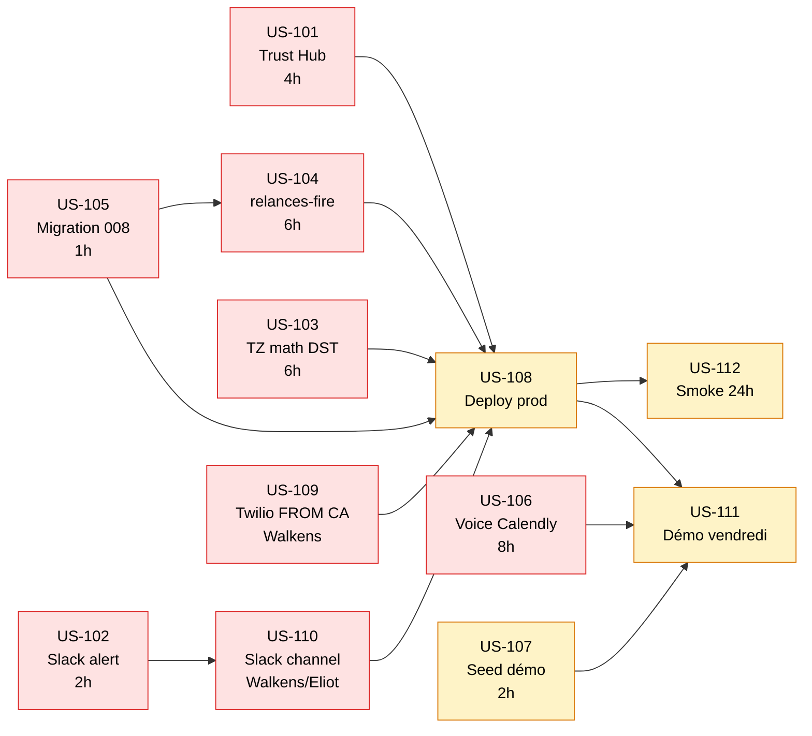
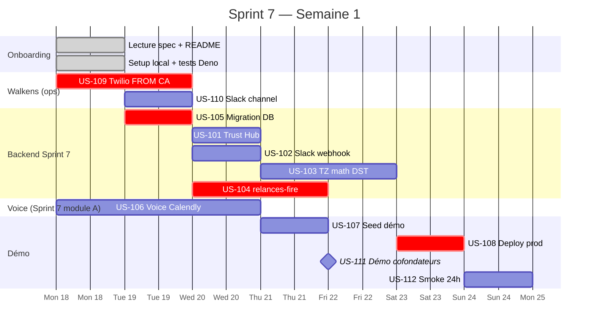

# Sprint 7 — Backlog Priorisé

> **Thème Sprint 7 :** Relances scheduler prod + Voice action layer (Calendly)
> **Durée :** 4 semaines (M3-M4)
> **Date de démarrage :** 2026-05-18
> **Équipe :** Dennis (backend) · Eliot (spec + démo) · Walkens (Twilio config + ops)

---

## Objectifs Sprint 7

**Objectif principal :** Scheduler relances en prod + démo voice action (Calendly) vendredi.

**Critères de succès :**
- ✅ Scheduler cron 15min tourne 24h sans erreur en prod
- ✅ 3 TODO critiques codés (Trust Hub · Slack · TZ math)
- ✅ Trigger automatique `relances-fire` crée pending rows
- ✅ Voice command « organise RDV avec X » crée event Calendly
- ✅ Démo cofondateurs vendredi avec 5 prospects réels

---

## Priorités

| Tag | Signification |
|-----|---------------|
| **P0** 🔴 | Bloquant Sprint 7 |
| **P1** 🟡 | Important MVP |
| **P2** 🟢 | Sprint 8 si pas le temps |
| **P3** ⚪ | Post-MVP |

---

## Dépendances tickets

**Chemin critique :** `US-105 → US-104 → US-108 → US-111` (déploiement + démo vendredi).
**Parallèles indépendants :** US-101, US-102, US-103, US-106 peuvent tourner en parallèle.

---

## Calendrier semaine 1

---

## Backlog détaillé

### 🔴 P0 — Scheduler relances prod

#### US-101 : Intégration Twilio Trust Hub sender score
**En tant que** ops admin Klaris,
**je veux** que le scheduler récupère le sender score réel via API Twilio,
**afin de** déférer les envois quand la réputation est dégradée (G12).

**Acceptance criteria**
- [ ] `twilioSenderScore()` appelle `https://trusthub.twilio.com/v1/CustomerProfiles/{sid}`
- [ ] Auth HTTP Basic (SID + token)
- [ ] Fallback `99` si HTTP error (fail-safe)
- [ ] Test Deno mock fetch · vérifie parse field correct
- [ ] Log score réel par tick scheduler

**Estimate** : 4h
**Dépendances** : Compte Twilio prod actif (US-109)
**Fichier** : `klaris_ios/supabase/functions/relances-scheduler/index.ts` ~340

---

#### US-102 : Slack webhook alertAdmin
**En tant que** ops admin Klaris,
**je veux** recevoir une alerte Slack en cas de budget Twilio dépassé ou sender score dégradé,
**afin de** réagir avant impact prod.

**Acceptance criteria**
- [ ] `alertAdmin()` POST vers webhook configurable via `SLACK_ADMIN_WEBHOOK`
- [ ] Message format `🚨 Klaris Scheduler — {message}`
- [ ] Fail silent si webhook absent ou timeout (3s max)
- [ ] Test : trigger manuel budget exceeded → message Slack reçu
- [ ] Channel `#klaris-prod-alerts` créé (US-110)

**Estimate** : 2h
**Dépendances** : US-110 (channel Slack)

---

#### US-103 : Timezone math précise DST-safe
**En tant que** système,
**je veux** calculer `nextBusinessDay9am()` avec précision DST,
**afin de** ne jamais envoyer SMS hors plage 8h-20h locale Québec.

**Acceptance criteria**
- [ ] Utilise `Intl.DateTimeFormat.formatToParts()` pour décomposition TZ-aware
- [ ] Test : 2026-03-07 (avant DST) → 9h EST = 14h UTC
- [ ] Test : 2026-03-09 (après DST) → 9h EDT = 13h UTC
- [ ] Test : 2026-11-01 (fin DST) → cohérent
- [ ] Test : same-day si appel avant 9h local
- [ ] Pas de régression sur 20 tests existants

**Estimate** : 6h
**Fichier** : `klaris_ios/supabase/functions/relances-scheduler/index.ts` ~250-265

---

#### US-104 : Edge Function `relances-fire` (création pending rows)
**En tant que** système,
**je veux** que les rows `relances` pending soient créées automatiquement quand un prospect devient inactif,
**afin de** alimenter le scheduler sans intervention manuelle.

**Acceptance criteria**
- [ ] Nouvelle Edge Function `klaris_ios/supabase/functions/relances-fire/index.ts`
- [ ] Cron `*/30 * * * *` (toutes 30 min)
- [ ] T1 `inactif_j2` : prospects sans `last_inbound_at` 2 jours + pas de relance j2 existante
- [ ] T2 `inactif_j5` : 5 jours + j2 déjà envoyée
- [ ] T6 `rdv_rappel_j1` : appointment scheduled J-1
- [ ] Insert `relances` avec `status='pending'`, `scheduled_for=now+2h`
- [ ] Tests Deno équivalents au scheduler
- [ ] Pas de double-fire (check existing avant insert)

**Estimate** : 6h
**Décision archi** : option B (cron séparé) recommandée — à valider Eliot

---

#### US-105 : Application migration 008 + RPC sur prod
**En tant que** dev,
**je veux** appliquer la migration `008_sprint7_relances_scheduler.sql` sur prod,
**afin de** débloquer le deploy des Edge Functions.

**Acceptance criteria**
- [ ] `psql "$SUPABASE_DB_URL_PROD" -f migrations/008_sprint7_relances_scheduler.sql` réussit
- [ ] Tables créées : `relances_scheduler_state`, `relance_decisions`, `holidays_qc`
- [ ] RPC `claim_pending_relances(p_batch_size)` exécutable par `service_role`
- [ ] Rows j10 existantes migrées (pending→skipped, sent→j5)
- [ ] CHECK constraint `relances_step_check` accepte uniquement `('j2','j5')`

**Estimate** : 1h
**Dépendances** : accès DB prod (Walkens)

---

### 🔴 P0 — Voice action layer (démo vendredi)

#### US-106 : Voice command → Calendly event
**En tant que** courtier,
**je veux** dire « organise un RDV avec Patrick demain 14h »,
**afin que** Klaris crée l'event Calendly + envoie SMS confirmation au prospect.

**Acceptance criteria**
- [ ] Voice transcript via Whisper (déjà câblé pour voicemail)
- [ ] Claude Sonnet `tool_use` : `create_appointment(prospect_id, datetime, duration)`
- [ ] Tool extrait prospect par nom fuzzy match (Levenshtein < 2)
- [ ] Calendly API call `POST /scheduled_events`
- [ ] SMS confirmation au prospect avec lien Calendly
- [ ] Audit log entry (OACIQ)
- [ ] Human-in-the-Loop : push notif iOS « approuve action » avant exécution
- [ ] Fallback EventKit iOS si Calendly indispo

**Estimate** : 8h
**Dépendances** : compte Calendly business · API key (Walkens)

---

### 🟡 P1 — Démo + déploiement

#### US-107 : Seed démo 5 prospects fictifs
**En tant que** Eliot,
**je veux** seed 5 prospects fictifs dans env dev,
**afin de** démontrer scheduler en live vendredi.

**Acceptance criteria**
- [ ] Script SQL `seeds/demo_sprint_7.sql` avec :
  - Mathieu Simard (score 9, inbound -3j)
  - Marie-Claude Tremblay (score 9, inbound -4j)
  - Patrick Côté (score 6, inbound -6j)
  - Isabelle Rousseau (score 5, inbound -5j)
  - Marc Dubois (status='perdu', démo G3)
- [ ] `relances-fire` créé pending rows
- [ ] `relances-scheduler` traite avec output prévisible

**Estimate** : 2h
**Dépendances** : US-104 deployed dev

---

#### US-108 : Déploiement scheduler + fire en prod
**En tant que** dev,
**je veux** déployer les 2 Edge Functions en prod avec crons,
**afin de** activer le système.

**Acceptance criteria**
- [ ] `supabase functions deploy relances-scheduler --project-ref <prod>`
- [ ] `supabase functions deploy relances-fire --project-ref <prod>`
- [ ] `supabase functions schedule create relances-scheduler --cron "*/15 * * * *"`
- [ ] `supabase functions schedule create relances-fire --cron "*/30 * * * *"`
- [ ] Secrets configurés : `TWILIO_*`, `SLACK_ADMIN_WEBHOOK`
- [ ] Test smoke 1× via curl

**Estimate** : 1h
**Dépendances** : US-101, US-102, US-103, US-104, US-105

---

#### US-109 : Twilio FROM_NUMBER prod activé Canada SMS
**En tant que** ops,
**je veux** que le numéro Twilio prod soit activé pour SMS sortants CA,
**afin de** permettre les envois de relances.

**Acceptance criteria**
- [ ] Numéro E.164 acheté Twilio (`+1438...` ou `+1514...`)
- [ ] A2P Toll-Free Verification ou Persona soumise (CRTC requirement depuis mars 2025)
- [ ] Test SMS sortant CA→CA passe
- [ ] `TWILIO_FROM_NUMBER` set dans Supabase secrets prod
- [ ] Sender ID enregistré chez Bell/Rogers/Telus si requis

**Estimate** : 2h ops + délai 24-72h validation Twilio
**Owner** : Walkens
**Dépendances** : compte Twilio business mode (pas trial)

---

#### US-110 : Slack channel #klaris-prod-alerts + webhook
**En tant que** ops,
**je veux** un channel Slack dédié aux alertes prod + webhook,
**afin de** centraliser monitoring.

**Acceptance criteria**
- [ ] Channel `#klaris-prod-alerts` créé · membres : Dennis, Eliot, Walkens, Seydou
- [ ] Slack App "Klaris Bot" créée · Incoming Webhook activé
- [ ] URL webhook copiée dans Supabase secrets (`SLACK_ADMIN_WEBHOOK`)
- [ ] Test : message manuel via curl → reçu dans channel

**Estimate** : 30 min
**Owner** : Eliot
**Dépendances** : aucune

---

#### US-111 : Démo cofondateurs vendredi
**En tant que** Eliot,
**je veux** présenter le scheduler + voice action en démo live,
**afin de** valider Sprint 7 livré.

**Acceptance criteria**
- [ ] Telegram bot connecté (channel démo)
- [ ] Voice command « combien de prospects chauds » → Klaris répond
- [ ] Voice command « organise RDV avec Patrick » → Calendly event créé
- [ ] Test STOP CASL (Marc Dubois) → BLOCK visible dans `relance_decisions`
- [ ] Détail prospect avec résumé IA + score affichés
- [ ] Captures vidéo pour Maxime Belma et Joanel

**Estimate** : 2h prep + 1h live
**Dépendances** : US-106, US-107

---

### 🟡 P1 — Observabilité + smoke test

#### US-112 : Smoke test prod 24h post-deploy
**En tant que** dev,
**je veux** vérifier que le scheduler tourne 24h sans erreur,
**afin de** valider la stabilité avant invite client.

**Acceptance criteria**
- [ ] 24h après deploy : `last_error_message` IS NULL dans `relances_scheduler_state`
- [ ] Time since `last_run_at` < 20 min en permanence
- [ ] Distribution `relance_decisions` saine (majorité BLOCK normal G4 OK)
- [ ] Pas de spike erreur Twilio (< 1 % failure rate)
- [ ] Sentry sans nouvelle exception relances-*

**Estimate** : 1h check + 24h elapsed
**Dépendances** : US-108

---

### 🟢 P2 — Out of scope Sprint 7 (Sprint 8)

| ID | Titre | Priorité |
|---|---|---|
| US-201 | Templates EN-CA (bilingue Persona) | P2 |
| US-202 | Twilio cost réel via API Usage | P2 |
| US-203 | Tests E2E Supabase local CI | P2 |
| US-204 | Briefing T11 fusion `daily-briefing` | P2 |
| US-205 | Dashboard web `/relances` parité iOS | P1 Sprint 8 |
| US-206 | Instagram DM intake (Maxime Belma) | P2 Sprint 8 |

---

## Décisions techniques à trancher Sprint 7

| ID | Question | Owner | Date limite |
|---|---|---|---|
| D-1 | Option fire : trigger SQL vs cron séparé vs unifié ? | Eliot (archi) | Lun M3 |
| D-2 | Retry Twilio : 1× vs 3× exponential ? | Dennis | Mer M3 |
| D-3 | Batch size scheduler : 100 vs 500 ? | Dennis | Mer M3 |
| D-4 | Calendly business plan vs Cal.com self-host ? | Walkens | Mar M3 |

---

## Définition de Done Sprint 7

- [ ] US-101 à US-112 livrés ou re-priorisés explicitement
- [ ] PR mergées sur main · tests verts (Deno + Flutter + Patrol E2E)
- [ ] Démo vendredi validée par Eliot + Walkens
- [ ] Smoke test prod 24h sans erreur
- [ ] Backlog Sprint 8 (US-201+) revu et priorisé
- [ ] Retro Sprint 7 documentée (1 page max)
