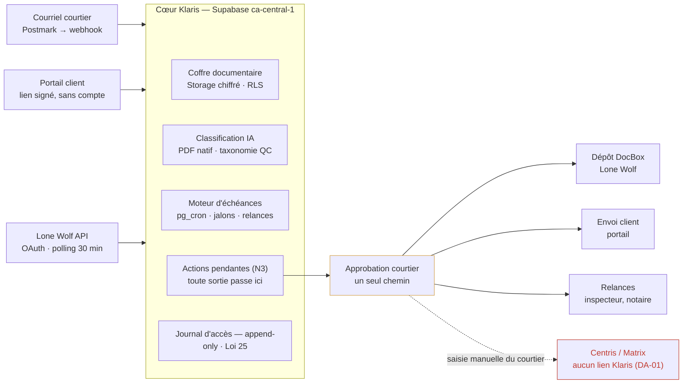
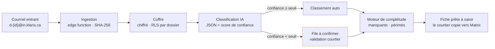
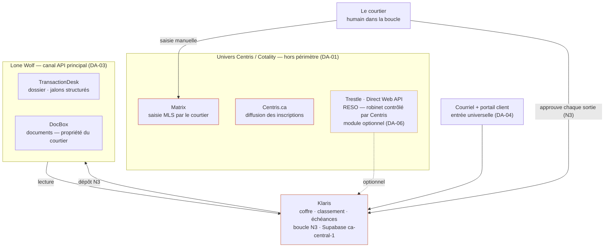

# Architecture technique — Klaris documentaire

Référence d'implémentation. Le pourquoi des décisions est dans [01-cadrage-produit.md](01-cadrage-produit.md) ; ici, le comment.

## 1. Stack

| Couche | Choix | Notes |
|---|---|---|
| Backend / DB | Supabase, région AWS `ca-central-1` (Montréal) | Loi 25 : hébergement canadien. Postgres + RLS + Storage + Auth + Edge Functions + `pg_cron` |
| Frontend | Netlify (React/Vite) | App courtier + portail client. Aucun document ne transite par Netlify — HTML statique seulement, fichiers servis par Storage via URL signée |
| IA | Gemini ou Claude API, PDF natif | Jamais de conversion PDF → image. Sortie structurée JSON contre la taxonomie |
| Courriel entrant | Postmark inbound (ou Mailgun routes) | Webhook signé → Edge Function |
| API partenaire | Lone Wolf TransactionDesk | OAuth code flow par courtier, polling 30 min (pas de webhooks documentés) |

## 2. Vue d'ensemble

Toute action sortante — dépôt DocBox, envoi client, relance — naît dans `actions_pendantes`, attend l'approbation du courtier, puis s'exécute. Un seul chemin de code (DA-02). Klaris ne touche jamais Centris ; le courtier saisit lui-même dans Matrix à partir de la fiche préparée.

## 3. Pipeline documentaire

Règle : **jamais de classement silencieux sous le seuil de confiance** — le doute part en file courtier. Le moteur de complétude est du SQL/TS pur contre la taxonomie, pas de l'IA.

## 4. Écosystème — qui possède quoi

- **Lone Wolf** (TransactionDesk + DocBox) : les documents appartiennent au courtier, l'API partenaire est ouverte, OAuth au nom du courtier → canal principal.
- **Trestle / Direct Web API** (Cotality) : existe techniquement, mais le MLS contrôle l'exposition → jamais une fondation, bonus éventuel.
- **Centris.ca / Matrix** : aucun lien Klaris, dans aucun sens. Seule la saisie manuelle du courtier y touche.

## 5. Composants — détail d'implémentation

### 5.1 Ingestion courriel
- Adresse unique par dossier : `d-{shortid}@in.klaris.ca` (Postmark inbound domain).
- Edge Function : vérifier la signature Postmark, extraire les pièces jointes, SHA-256 pour dédoublonnage, stocker `documents/{dossier_id}/{uuid}.pdf`, insérer ligne `documents` statut `recu`.
- Courriel sans dossier reconnaissable → file « à rattacher » côté courtier, jamais de rejet silencieux.

### 5.2 Classification
- Worker (Edge Function ou queue) : chaque document `recu` → appel modèle avec le PDF natif + la taxonomie → sortie structurée `{type, champs_extraits, date_document, confiance}`.
- `confiance < seuil` → statut `a_confirmer`, apparaît dans la file du courtier.
- Chaque appel journalisé dans `couts_inference` (métrique n°4 du pilote).

### 5.3 Complétude
- Règles déclaratives de la taxonomie (YAML) : documents obligatoires par type de dossier et par étape, règles de péremption (ex. certificat de localisation > 10 ans).
- Évaluation en SQL/TS pur → liste `manquants` / `perimes` par dossier → alimente la fiche et les alertes.

### 5.4 Moteur d'échéances
- Jalons upsert depuis l'API Lone Wolf (source `api`) ou saisis à la main (source `manuel`) — le moteur ne dépend pas de l'API (DA-05 : structuré d'abord, PDF en repli confirmé).
- `pg_cron` quotidien : relances dues à J-7 / J-3 / J-1 → création d'`actions_pendantes` type `relance`.
- Polling Lone Wolf : 30 min, resserré à 10 min quand un jalon est à moins de 7 jours.

### 5.5 Boucle N3
- Table unique `actions_pendantes` : `proposee → approuvee | refusee → executee`.
- L'exécution (dépôt DocBox, envoi courriel, relance) ne lit que les lignes `approuvee`. Aucun autre chemin de sortie n'existe dans le code.

### 5.6 Portail client
- Token aléatoire 256 bits, stocké hashé, expiration 30 jours renouvelable, révocable.
- Accès uniquement via Edge Function qui valide le token et ne sert que les documents du dossier lié — jamais d'accès Postgres direct côté client.
- Chaque consultation → `journal_acces`.

### 5.7 Intégration Lone Wolf (quand l'accès partenaire arrive)
- OAuth code flow ; refresh token chiffré (Supabase Vault / pgsodium).
- Lecture : transactions du courtier → jalons (`offerAcceptanceDate`, `closingDate`, …) + inventaire DocBox.
- Écriture : dépôt DocBox = action N3 comme les autres.
- Pré-production d'abord ; production après entente partenaire.

## 6. Séquence de construction

| Semaine | Livrable | Dépendance externe |
|---|---|---|
| 1 | Formulaire partenaire Lone Wolf soumis · projet Supabase + migration initiale · taxonomie v1 | — |
| 2–3 | Ingestion courriel bout en bout · classification + file à confirmer · complétude | — |
| 3–4 | UI courtier (dossiers, fiche, manquants) · boucle N3 | — |
| 4–5 | Portail client lien signé · journal d'accès | — |
| 5–6 | Moteur d'échéances (jalons manuels) · tests bloquants CI | — |
| 6+ | Intégration Lone Wolf pré-prod (parallèle, dès réponse) | Lone Wolf |

**Tout le chemin critique tient sans réponse de Lone Wolf ni de Centris** (DA-04 / DA-06). Le pilote entier peut tourner sur l'entrée courriel.

## 7. Tests bloquants (CI — échec = pas de déploiement)

1. **Accès croisé** : token portail du client A sur chaque endpoint avec des identifiants du client B → 403 + ligne `journal_acces`.
2. **RLS** : JWT courtier A en requête directe sur les dossiers du courtier B → zéro ligne.
3. Token portail expiré ou révoqué → 401.
4. Classification : jeu d'or de PDF réels annotés, exactitude mesurée par type (métrique n°3 du pilote).

Détail SQL et politiques : [03-modele-donnees.md](03-modele-donnees.md).
