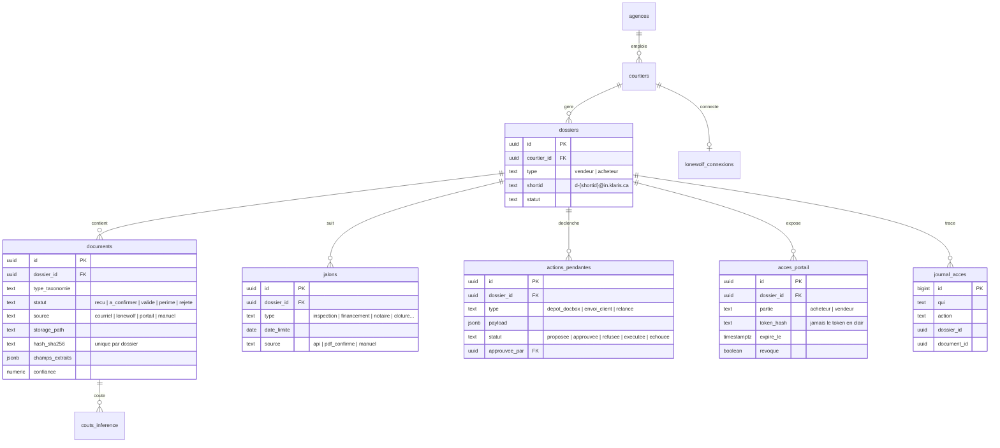
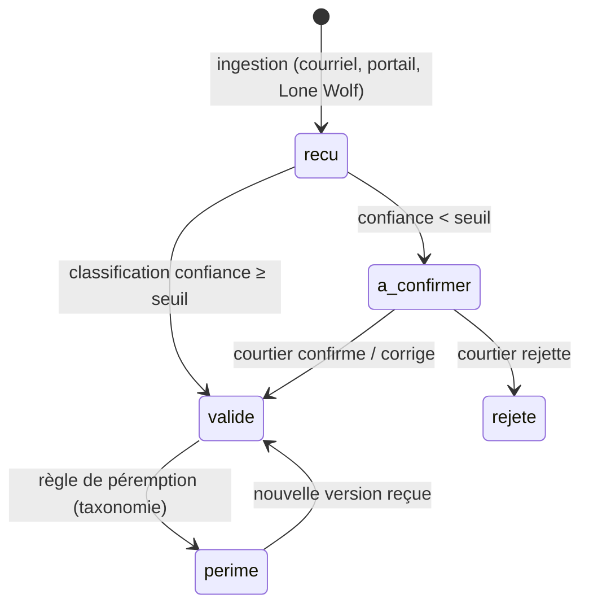
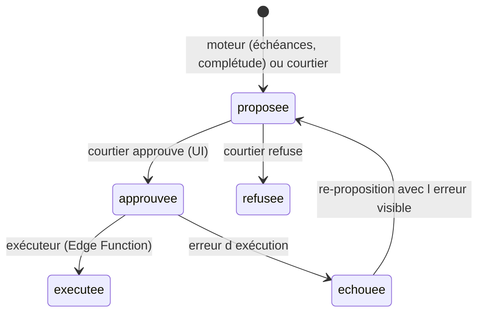

# Modèle de données — Klaris documentaire

Migration prête à exécuter : [sql/000_klaris_documentaire_schema.sql](sql/000_klaris_documentaire_schema.sql) (schéma dédié `klaris_doc`, isolé du reste de NextMove).

## Schéma

## Invariants (à ne jamais casser)

1. **Cloisonnement** : toute table porteuse de données de dossier a une politique RLS `dossier → courtier → auth.uid()`. Le portail client ne touche jamais Postgres directement — Edge Function service-role qui filtre par `dossier_id` du token.
2. **N3** : `actions_pendantes` est l'unique chemin de sortie. L'exécuteur ne lit que `statut = 'approuvee'`. Pas de code d'envoi ailleurs.
3. **Journal append-only** : `journal_acces` sans `update` ni `delete`, même pour le propriétaire.
4. **Tokens** : portail = hash SHA-256 stocké, jamais le token en clair. Lone Wolf = refresh token chiffré (Vault/pgsodium).
5. **Dédoublonnage** : `unique (dossier_id, hash_sha256)` — le même PDF transféré deux fois ne crée pas deux documents.
6. **Statut `a_confirmer`** : un document sous le seuil de confiance n'est jamais classé silencieusement.

## Cycle de vie d'un document

## Cycle de vie d'une action N3

## Tests bloquants (CI)

| # | Test | Attendu |
|---|---|---|
| 1 | Token portail client A + `dossier_id` du client B, chaque endpoint | 403 + ligne `journal_acces` action `refus` |
| 2 | JWT courtier A, `select` sur dossiers/documents/jalons du courtier B | 0 ligne |
| 3 | Token portail expiré ou `revoque = true` | 401 |
| 4 | `update`/`delete` sur `journal_acces`, tout rôle non-superuser | erreur |
| 5 | Même PDF transféré 2× sur un dossier | 1 seul document |
| 6 | Action `proposee` (non approuvée) → exécuteur | rien ne part |

Échec de 1-4 = déploiement bloqué. C'est le test du cadrage §4.3 : *le client A ne voit jamais un document du client B*.
