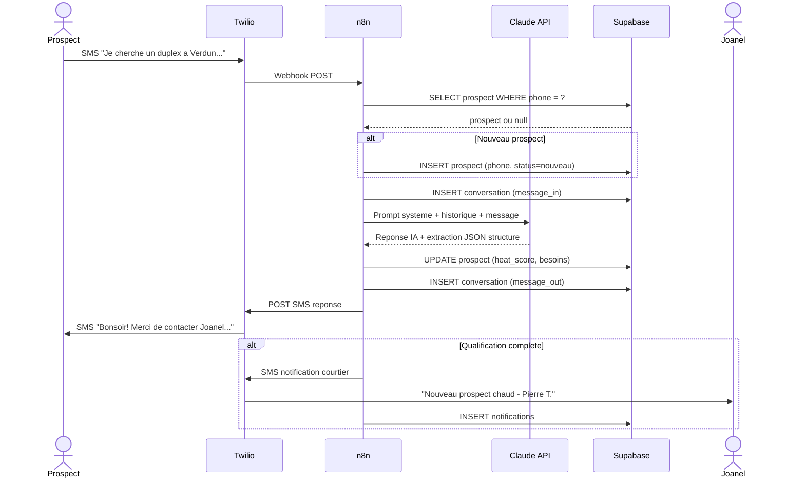

# Contexte Sprint MVP — Extraction Figma

> Extraction du Figma [Personas-Courtiers-Immobiliers — Atelier-JTBD](https://www.figma.com/design/JXlxEfExXxH1sVpXFnwFKH/)
> Node analysé : `17:2` (Sprint MVP Board)
> Date d'extraction : 2026-04-17

**⚠️ ATTENTION :** Ce Figma est le **board de planification du sprint** (pas les templates SMS comme initialement supposé). Les templates SMS doivent se trouver ailleurs (à confirmer avec Eliot).

---

## 1. Produit et contexte

| Élément | Valeur |
|---------|--------|
| **Nom du produit** | Adjointe IA du Courtier Immobilier |
| **Entité** | NextMove Inc. |
| **Date** | Avril 2026 |
| **Méthodologie** | Design Sprint + Lean Startup + Shape Up |
| **Courtier pilote** | **Joanel** (pas Joanel) |
| **Futurs utilisateurs** | Maxime, Charlyse, JP |

**⚠️ Clarification nécessaire :** Qui est Joanel dans le dispositif ? Propriétaire produit / investisseur / un des courtiers ? À vérifier avec Eliot.

---

## 2. Phases Design Thinking

| Phase | Statut | Contenu |
|-------|--------|---------|
| **Empathie** | ✅ Complete | Interviews Joanel, Maxime, Charlyse & JP — Atelier JTBD complet |
| **Définition** | ✅ Complete | 4 Lean Personas définis, douleurs priorisées, forces de progrès |
| **Idéation** | ✅ Complete | Baguette magique, segmentation automatisation, chemin idéal 80/20 |
| **Prototype** | 🟠 En cours | **Sprint MVP 3 jours (vendredi-dimanche)** |
| **Test** | ⬜ À venir | Démo courtier pilote, itérations, métriques cibles |

---

## 3. Équipe — 4 rôles

| Rôle | Livrable clé |
|------|--------------|
| 🧠 **Architecte IA** | Prompt système + flux conversationnel qui close en < 9 questions |
| ⚙️ **Backend / Infra** | DB en prod + schéma déployé + CRUD clients fonctionnel |
| 🔗 **Intégration / Flows** | SMS → IA → notification courtier end-to-end |
| 🎯 **Produit / UX** | MVP utilisable + démo live + feedback collecté |

---

## 4. Scope Sprint 1 — « Elle répond et collecte »

### ✅ Dans le scope (3 jours)

1. Réponse automatique **< 60 secondes** au SMS
2. **Flux acheteur guidé : 9 questions structurées**
3. **Flux vendeur guidé : 6 questions structurées**
4. Fiche client auto-générée dans Supabase
5. **Score chaleur automatique (chaud / tiède / froid)**
6. Notification courtier par SMS + courriel (résumé)
7. **Relances automatiques (J+2, J+5, J-1 avant RDV)** ⚠️ **CADENCES RÉELLES**
8. **Briefing quotidien envoyé à 7h30** chaque matin ⚠️ **NOUVEAU TRIGGER**
9. Dashboard simple pour le courtier

### ❌ Hors scope (backlog)

- Intégration Matrix / Centris
- Génération automatique d'offres d'achat
- Analyse de comparables de marché
- Appels vocaux par IA
- Multi-courtier (SaaS)
- Application mobile native
- Visibilité hypothécaire en temps réel
- Prospection automatisée
- **Calendrier Google (v2 post-sprint)** — planifié Sprint 2

---

## 5. Stack technique (validée Figma)

### Diagramme de séquence — Flux SMS entrant complet



### Vue texte

```
SMS entrant (Twilio) / Telegram dans un premier temps
        ↓
n8n (orchestration)
        ↓
Claude API (claude-sonnet-4-6)
        ↓
Supabase (PostgreSQL)
        ↓
Réponse SMS sortant (Twilio)
```

| Composant | Valeur |
|-----------|--------|
| **Tables DB** | `clients`, `conversations`, `relances`, `rendez_vous`, `config_courtier` |
| **Hébergement** | Canada (ca-central-1) — conformité Loi 25 QC |
| **Coût estimé** | **35-50 $ / mois** ⚠️ (bien inférieur à l'hypothèse 500 CAD) |
| **IA** | Claude Sonnet 4.6 via Anthropic API |
| **Notifications** | SMS (Twilio) + Courriel (SendGrid) |
| **Crons** | Relances J+2, J+5, J-1 + Briefing 7h30 |

---

## 6. ⚠️ Écarts identifiés entre Figma et ma matrice actuelle

### 🔴 Écart 1 — Cadences de relance

| Mon hypothèse | Figma réel |
|---------------|-----------|
| T1 = J+7 | **T1 = J+2** |
| T2 = J+14 | **T2 = J+5** |
| T3 = J+21 | *(pas de T3)* |
| Pas de relance RDV | **J-1 avant RDV** |

**Impact :** La matrice M1 + M3 doit être **recalibrée** avec les vrais délais.

### ✅ Écart 2 — Table `clients` = `prospects` (résolu)

Le Figma mentionne `clients`, le schema GitHub mentionne `prospects`.

**Résolution (Eliot, 2026-04-17) :** `clients` et `prospects` désignent **la même table**. On peut garder l'un ou l'autre nom. Le schéma GitHub (`prospects`) fait foi pour le code.

### 🟡 Écart 3 — Budget

| Mon hypothèse | Figma réel |
|---------------|-----------|
| 500 CAD / mois | **35-50 CAD / mois** |

**Impact :** G11 (garde-fou budget) à ajuster — cap plus strict.

### 🟡 Écart 4 — Briefing quotidien 7h30

**Trigger absent de ma matrice.** À ajouter comme **T11** :

> **T11 :** Briefing quotidien courtier à 7h30 — résumé des activités de la veille + action items du jour.

### 🟡 Écart 5 — Multi-canal d'entrée

Le Figma mentionne **"Twilio/Telegram dans un premier temps"**. Télégram n'était pas dans mes hypothèses. À vérifier si le système de relance doit supporter les deux canaux.

### 🟢 Écart 6 — Nom du courtier

J'ai utilisé "Joanel" comme propriétaire produit dans tous mes documents. Le Figma mentionne **Joanel** comme courtier pilote. Eliot : qui est qui ?

---

## 7. Roadmap confirmée

| Étape | Contenu | Statut |
|-------|---------|--------|
| **Semaine 1-2 post-sprint** | Utilisation réelle par Joanel, collecte métriques + feedback | Post Sprint 1 |
| **Sprint 2** | **« Elle relance et organise »** — Calendrier Google, planification visites, dashboard enrichi | Correspond à mon backlog |
| **Sprint 3** | « Elle analyse et génère » — Analyse comparables, génération offres d'achat | Post-MVP |
| **V1 Publique** | Multi-courtier, onboarding Maxime/Charlyse/JP, pricing & modèle d'affaires | Horizon long |

---

## 8. Métriques de succès (Figma)

| Métrique | Avant | Après (cible) |
|----------|-------|---------------|
| **Temps 1re réponse** | 1-4 heures | **< 1 minute** |
| **Documents reçus < 5j** | ~50% | **80%** |
| **Relances oubliées / semaine** | 3-5 | **0** |
| **Prospects perdus** | ~30% | **< 10%** |
| **Temps admin / jour** | 3-4 heures | **30 min** |

---

## 9. Definition of Done Sprint 1 (Figma)

Le MVP est « DONE » dimanche 19h quand :

1. ☐ Un prospect peut envoyer un SMS au numéro du courtier
2. ☐ L'IA répond en < 60 secondes, en français QC naturel
3. ☐ L'IA collecte les infos (acheteur OU vendeur) via conversation guidée
4. ☐ Une fiche client est créée automatiquement dans Supabase
5. ☐ Le courtier reçoit une notification SMS + email avec le résumé
6. ☐ Les relances automatiques sont planifiées (J+2, J+5, J-1)
7. ☐ Le courtier reçoit un briefing quotidien à 7h30
8. ☐ Le courtier pilote a vu la démo et dit : « Je veux l'utiliser »

---

## 10. Questions ouvertes pour Eliot

1. **🔴 Où sont les templates SMS happy path ?** (pas dans ce Figma)
2. **🔴 Joanel vs Joanel** — qui est le propriétaire produit / décisionnaire ?
3. **🟡 Table `clients` vs `prospects`** — même chose ou 2 tables ?
4. **🟡 Telegram** — canal MVP ou juste mentionné en alternative ?
5. **🟡 Sprint 1 statut** — déjà terminé (schema.md poussé) ou toujours en cours ?
6. **🟢 Budget 35-50$** — valide ou à réévaluer avec volume cible ?

---

## 11. Actions immédiates (mise à jour des docs)

Les documents suivants doivent être recalibrés suite à cette extraction :

- [ ] `docs/relances-decision-matrix.md` — section M1 (cadences J+2/J+5/J-1) + ajout T11 briefing quotidien
- [ ] `docs/templates-sms-specifications.md` — noter que templates ne sont pas dans ce Figma
- [ ] `docs/business-constraints-checklist.md` — budget Twilio 35-50$
- [ ] `sprint-2/backlog-sprint-2.md` — aligner avec scope « Elle relance et organise »
- [x] `workshop/agenda-workshop-joanel.md` — renommé Dennis → Joanel (fait le 2026-04-17)

---

*Synthèse extraction Figma — v1.0*
