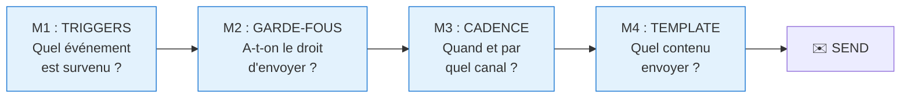
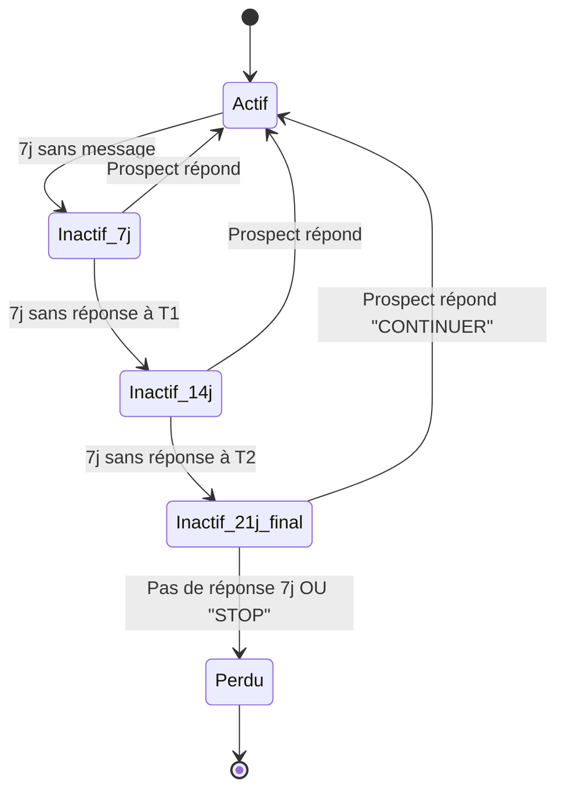
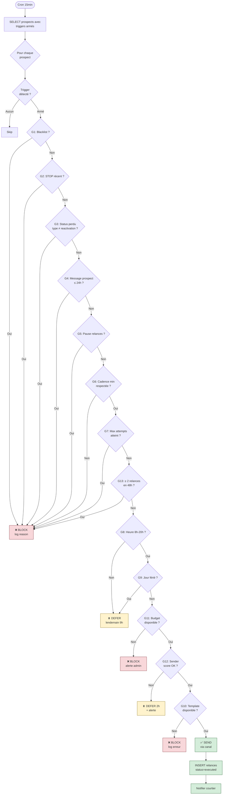
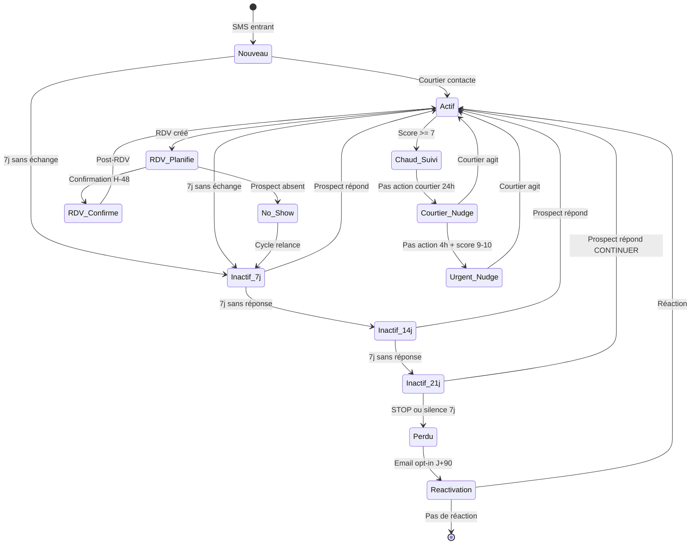
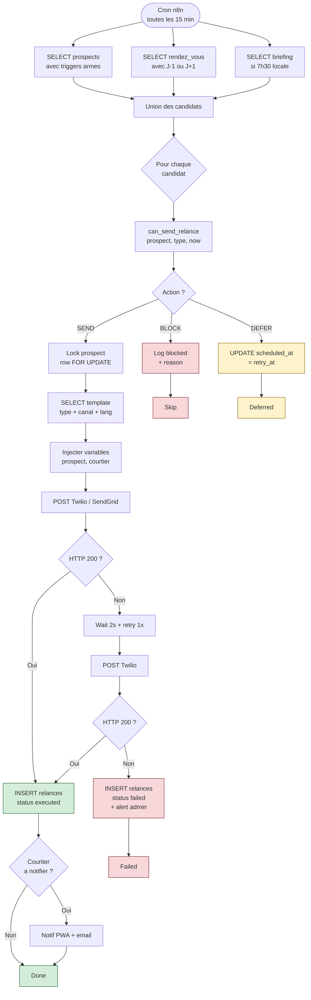

# NextMove — Matrice de Décision Relance

> Document maître du système de relance automatisé.
> Définit quoi, quand, comment, et pourquoi NextMove envoie des messages aux prospects et courtiers.

**Version :** 1.1 (recalibré post-Figma)
**Date :** 2026-04-17
**Audience :** Propriétaire produit, Eliot (architecture), équipe dev Sprint 2

> ⚠️ **Recalibration post-Figma (v1.2)** — Ajustée suite aux 3 extractions Figma (Sprint MVP Board, Personas, Wireframes SMS node 62:2). Voir [`contexte-sprint-figma.md`](./contexte-sprint-figma.md) et [`templates-sms-figma-extraits.md`](./templates-sms-figma-extraits.md).
>
> Principaux changements :
> - **Cadences relance inactivité** : J+7/J+14/J+21 → **J+2/J+5** (T3 retiré)
> - **RDV** : H-48 confirmation → **J-1 simple rappel** (pas OUI/NON, juste info)
> - **Ajout T11** : briefing quotidien courtier à 7h30 (format structuré validé Figma)
> - **Budget Twilio** : 500 CAD → 35-50 CAD/mois
> - **Signature** : « NextMove pour {courtier} » → « l'assistante de {courtier} »
>
> ⚠️ **Point à clarifier avec Joanel :** La relance Figma J+2 est CONTEXTUELLE (documents pré-qualif en attente), pas "inactif" générique. Le vrai `inactif_j2` existe-t-il ou est-ce toujours une relance d'étape ? Voir section [templates-sms-figma-extraits.md § Divergence 1](./templates-sms-figma-extraits.md).

---

## Table des matières

- [1. Vue d'ensemble](#1-vue-densemble)
- [2. Matrice M1 — Triggers (événements déclencheurs)](#2-matrice-m1--triggers)
- [3. Matrice M2 — Garde-fous (règles de blocage)](#3-matrice-m2--garde-fous)
- [4. Matrice M3 — Cadence, canal et timing](#4-matrice-m3--cadence-canal-timing)
- [5. Matrice M4 — Arbre de décision algorithmique](#5-matrice-m4--arbre-de-decision)
- [6. Diagramme d'état du prospect](#6-diagramme-detat-du-prospect)
- [7. Pseudo-code `can_send_relance()`](#7-pseudo-code-can_send_relance)
- [8. Glossaire](#8-glossaire)

---

## 1. Vue d'ensemble

### Architecture en 4 couches de décision

Pour chaque prospect, à chaque exécution du scheduler (toutes les 15 minutes), les 4 matrices s'exécutent **séquentiellement** :



### Principes directeurs

1. **Silencieux par défaut** : mieux vaut ne pas relancer que relancer mal (risque réputation + spam).
2. **Transparent pour le courtier** : toute relance automatique est loguée et notifiée.
3. **Respect strict du consentement** : Loi 25 QC, opt-out immédiat.
4. **Progression de la pression** : chaque relance change d'angle, apporte de la valeur.
5. **Heure locale du prospect** : jamais de SMS avant 8h ou après 20h.

---

## 2. Matrice M1 — Triggers

**Question :** Quel événement métier déclenche une relance ?

| ID | Événement déclencheur | Type de relance | Destinataire | Canal | MVP |
|----|----------------------|-----------------|--------------|-------|-----|
| **T1** | Prospect sans interaction depuis **2 jours** (J+2) | `inactif_j2` | Prospect | SMS | ✅ **P0 (Figma)** |
| **T2** | Prospect sans interaction depuis **5 jours** (J+5, après T1 sans réponse) | `inactif_j5` | Prospect | SMS | ✅ **P0 (Figma)** |
| **T3** | ~~Prospect sans interaction depuis 21 jours~~ | ~~`inactif_21j_final`~~ | — | — | ❌ Retiré |
| **T4** | Prospect `heat_score ≥ 7` sans action courtier **> 24h** | `nudge_courtier_chaud` | Courtier | Notif push + Email | ✅ P0 |
| **T5** | Prospect `heat_score ≥ 9` sans action courtier **> 4h** | `nudge_courtier_urgent` | Courtier | SMS + Notif push | 🟢 P2 |
| **T6** | RDV planifié à **J-1** (la veille) sans confirmation | `rdv_rappel_j1` | Prospect | SMS | ✅ **P0 (Figma)** |
| **T6bis** | RDV planifié à **J-7** (optionnel) | `rdv_rappel_j7` | Prospect | SMS | 🟢 P2 |
| **T7** | RDV passé depuis **24h** | `post_rdv_feedback` | Prospect | SMS | 🟢 P2 |
| **T8** | Pré-approbation promise mais non reçue après **5 jours** | `etape_financement` | Prospect + Courtier | SMS + Notif | 🟢 P2 |
| **T9** | Prospect `status = 'perdu'` depuis **90 jours** (opt-in email obligatoire) | `reactivation_longterme` | Prospect | Email uniquement | ⚪ P3 |
| **T10** | Anniversaire de la première interaction (optionnel) | `relation_fidelisation` | Prospect | Email | ⚪ P3 |
| **T11** | **Chaque matin à 7h30** — briefing courtier | `briefing_quotidien` | Courtier | Email (principal) + SMS | ✅ **P0 (Figma)** |

**Séquence d'inactivité (T1 → T2 → T3) :**



**Notes importantes :**

- **T1-T3 forment une séquence progressive**, pas 3 relances indépendantes.
- Si le prospect répond à n'importe quelle étape, toute la séquence est **annulée** et remise à zéro.
- **T9 exige un opt-in email explicite** au moment de la collecte du prospect. Sans opt-in, T9 **ne se déclenche jamais**.
- **T10 est purement optionnel** — à activer si Joanel souhaite du marketing relationnel.

---

## 3. Matrice M2 — Garde-fous

**Question :** Le trigger est armé. A-t-on le droit d'envoyer ?

**Ordre d'évaluation** (si UNE règle bloque → STOP, on n'envoie pas) :

| # | Règle | Action si TRUE | Raison |
|---|-------|----------------|--------|
| **G1** | Téléphone/email dans `blacklist` | ❌ **BLOCK DÉFINITIF** | Opt-out légal (Loi 25 QC) |
| **G2** | Prospect a répondu STOP dans les 90 derniers jours | ❌ **BLOCK DÉFINITIF** | Consentement retiré |
| **G3** | Prospect `status = 'perdu'` ET type ≠ `reactivation_longterme` | ❌ BLOCK | Pipeline fermé |
| **G4** | Prospect a envoyé un message dans les dernières **24h** | ❌ BLOCK | Humain actif, on n'interfère pas |
| **G5** | Courtier a marqué `pause_relances = true` sur ce prospect | ❌ BLOCK | Override manuel |
| **G6** | Même type de relance déjà envoyé dans la cadence minimale | ❌ BLOCK | Anti-doublon |
| **G7** | `attempt_count ≥ max_attempts` pour ce type | ❌ BLOCK | Limite d'essais atteinte |
| **G8** | Heure locale prospect hors **8h00–20h00** QC | ⏸️ **DÉCALER** lendemain 9h | Respect horaire |
| **G9** | Jour férié Québec (1er janvier, Fête nationale, Noël, etc.) | ⏸️ DÉCALER jour ouvrable suivant | Non intrusion |
| **G10** | Template manquant pour (type, canal, langue) | ❌ BLOCK + log erreur | Sécurité de contenu |
| **G11** | Coût cumulatif mensuel Twilio > budget défini | ❌ BLOCK + alerte admin | Protection financière |
| **G12** | Numéro Twilio sender score dégradé (>3% spam reports) | ⏸️ DÉCALER 2h + alerte | Protection réputation |
| **G13** | ≥ 2 relances TOUS TYPES CONFONDUS dans les 48 dernières heures | ❌ BLOCK | Anti-harcèlement global |

### Paramètres associés

| Type de relance | Cadence min (entre 2 envois) | Max attempts |
|----------------|------------------------------|---------------|
| `inactif_j2` | 5 jours | 1 |
| `inactif_j5` | 30 jours | 1 |
| `nudge_courtier_chaud` | 48 heures | 3 |
| `nudge_courtier_urgent` | 4 heures | 5 |
| `rdv_rappel_j1` | 1 par RDV | 1 |
| `rdv_rappel_j7` | 1 par RDV | 1 |
| `post_rdv_feedback` | 1 par RDV | 1 |
| `etape_financement` | 5 jours | 2 |
| `reactivation_longterme` | 180 jours | 1 |
| `briefing_quotidien` | 24 heures | 1 par jour |

### Jours fériés Québec 2026 (à intégrer en config)

- 1er janvier — Jour de l'An
- 2 janvier — Lendemain du Jour de l'An (selon convention)
- 3 avril — Vendredi saint
- 6 avril — Lundi de Pâques
- 18 mai — Journée nationale des patriotes
- 24 juin — Fête nationale du Québec
- 1er juillet — Fête du Canada
- 7 septembre — Fête du Travail
- 12 octobre — Action de grâces
- 25 décembre — Noël
- 26 décembre — Lendemain de Noël

---

## 4. Matrice M3 — Cadence, canal, timing

**Question :** Quand et par quel canal ?

### Tableau consolidé

| Type relance | Canal principal | Fallback | Délai depuis trigger | Cadence min | Max tentatives | Fenêtre optimale |
|--------------|----------------|----------|---------------------|-------------|---------------|------------------|
| `inactif_j2` | SMS | — | Immédiat | 5j | 1 | Mar–Jeu 10h–12h |
| `inactif_j5` | SMS | Email (si opt-in) | Immédiat | 30j | 1 | Mar–Jeu 10h–12h |
| `nudge_courtier_chaud` | Notif push | Email | Immédiat | 48h | 3 | Heures ouvrables courtier |
| `nudge_courtier_urgent` | SMS + Notif | Email | Immédiat | 4h | 5 | 7j/7, 6h–22h |
| `rdv_rappel_j1` | SMS | Email | J-1 à 18h locale prospect | 1 par RDV | 1 | 17h–19h |
| `rdv_rappel_j7` | SMS | Email | J-7 à 10h locale prospect | 1 par RDV | 1 | 9h–12h |
| `post_rdv_feedback` | SMS | — | H+24 après RDV | 1 par RDV | 1 | 10h–12h ou 17h–19h |
| `etape_financement` | SMS + Notif | — | J+5 après promesse | 5j | 2 | Mar–Jeu 10h–12h |
| `reactivation_longterme` | **Email uniquement** | — | Immédiat | 180j | 1 | Mardi 10h |
| `briefing_quotidien` | Email | SMS (si activé) | **Chaque matin 7h30** | 24h | 1 par jour | 7h30 locale courtier |

### Règles d'or UX

- ❌ **Jamais de relance prospect le lundi matin (8h-11h)** — démarrage de semaine, taux de lecture bas.
- ❌ **Jamais de relance vendredi après 16h** — mindset week-end, taux de réponse < 10%.
- ✅ **Golden hour immobilier : Mardi-Jeudi 10h-12h** — à valider avec la donnée terrain de Joanel.
- ✅ **Le courtier peut être relancé plus agressivement** — il est payé pour répondre.

### Escalade progressive (ton & effort)

| Relance | Ton | Effort système | Exemple |
|---------|-----|----------------|---------|
| T1 (J+7) | Question courte, low-effort | Minimal | "Bonjour Marie, toujours en recherche d'un condo à Montréal ?" |
| T2 (J+14) | Value-add | Moyen | "Bonjour Marie, voici 3 nouveaux biens qui matchent votre profil ⬇" |
| T3 (J+21) | Option de sortie claire | Final | "Bonjour Marie, souhaitez-vous qu'on continue ? Répondez CONTINUER ou STOP" |

Chaque message doit apporter **quelque chose de nouveau** — pas une répétition polie.

---

## 5. Matrice M4 — Arbre de décision

Diagramme complet du flow scheduler → envoi :



---

## 6. Diagramme d'état du prospect



---

## 6bis. Flow technique du scheduler n8n

Vue opérationnelle du cron 15min — du SELECT aux envois Twilio/SendGrid avec retry :



### Points d'attention techniques

- **Lock `FOR UPDATE`** sur `prospects` pour éviter qu'un même prospect soit traité deux fois si le cron chevauche
- **Retry 1x après 2 secondes** si Twilio HTTP ≠ 200 (erreur transitoire classique)
- **Alert admin** après 2 échecs consécutifs (ex: Slack webhook, email admin)
- **Logs structurés** : chaque relance tracée avec `reason` (BLOCK) ou `error_message` (FAIL)
- **Idempotence** : si le cron crashe et redémarre, le `FOR UPDATE` + `status='executed'` garantit pas d'envoi double

---

## 7. Pseudo-code `can_send_relance()`

**Fonction PostgreSQL** (ou application logic) qui centralise tous les garde-fous.

```python
def can_send_relance(prospect, type_relance, now):
    """
    Retourne un objet Decision avec :
    - action: 'SEND' | 'BLOCK' | 'DEFER'
    - reason: string explicite (pour logs)
    - retry_at: datetime (si DEFER)
    """

    # === BLOCKS DÉFINITIFS ===
    if prospect.phone in blacklist_table:
        return BLOCK("blacklist_phone")

    if prospect.opted_out_at and (now - prospect.opted_out_at) < timedelta(days=90):
        return BLOCK("opted_out_stop")

    if prospect.status == 'perdu' and type_relance != 'reactivation_longterme':
        return BLOCK("pipeline_closed")

    if prospect.last_inbound_message_at and (now - prospect.last_inbound_message_at) < timedelta(hours=24):
        return BLOCK("human_active")

    if prospect.pause_relances:
        return BLOCK("courtier_override")

    # === LIMITES DE CADENCE ===
    last_same_type = get_last_relance(prospect.id, type_relance)
    if last_same_type:
        cadence_min = CADENCE_MIN[type_relance]
        if (now - last_same_type.sent_at) < cadence_min:
            return BLOCK(f"cadence_not_elapsed_{cadence_min.days}d")

    if attempt_count(prospect.id, type_relance) >= MAX_ATTEMPTS[type_relance]:
        return BLOCK("max_attempts_reached")

    # === ANTI-HARCÈLEMENT GLOBAL ===
    relances_48h = count_all_relances(prospect.id, since=now - timedelta(hours=48))
    if relances_48h >= 2:
        return BLOCK("global_spam_guard_48h")

    # === HORAIRES ===
    local_hour = prospect.timezone_hour(now)
    if local_hour < 8 or local_hour >= 20:
        next_morning = next_business_day_9am(now, prospect.timezone)
        return DEFER(next_morning, reason="outside_business_hours")

    if is_quebec_holiday(now):
        next_day = next_business_day_9am(now, prospect.timezone)
        return DEFER(next_day, reason="quebec_holiday")

    # === PROTECTION INFRA ===
    if twilio_monthly_cost() > BUDGET_MAX_CAD:
        alert_admin("Budget Twilio dépassé")
        return BLOCK("budget_exceeded")

    if twilio_sender_score() < 97:
        alert_admin("Sender score dégradé")
        return DEFER(now + timedelta(hours=2), reason="sender_score_degraded")

    # === TEMPLATE ===
    if not template_exists(type_relance, canal='sms', lang='fr-CA'):
        return BLOCK("no_template_available")

    return SEND(reason="all_guards_passed")
```

### Constantes associées

```python
CADENCE_MIN = {
    'inactif_7j': timedelta(days=14),
    'inactif_14j': timedelta(days=14),
    'inactif_21j_final': timedelta(days=30),
    'nudge_courtier_chaud': timedelta(hours=48),
    'nudge_courtier_urgent': timedelta(hours=4),
    'rdv_confirmation': timedelta(days=1),  # max 2 par RDV
    'post_rdv_feedback': timedelta(days=30),
    'etape_financement': timedelta(days=7),
    'reactivation_longterme': timedelta(days=180),
}

MAX_ATTEMPTS = {
    'inactif_7j': 1,
    'inactif_14j': 1,
    'inactif_21j_final': 1,
    'nudge_courtier_chaud': 3,
    'nudge_courtier_urgent': 5,
    'rdv_confirmation': 2,
    'post_rdv_feedback': 1,
    'etape_financement': 2,
    'reactivation_longterme': 1,
}

BUDGET_MAX_CAD = 500  # À valider avec Joanel
```

---

## 8. Glossaire

| Terme | Définition |
|-------|-----------|
| **Courtier** | Agent immobilier utilisateur de NextMove (tenant principal) |
| **Prospect** | Personne ayant contacté un courtier (acheteur ou vendeur) |
| **Relance** | Message automatisé envoyé à un prospect ou courtier selon règles métier |
| **Trigger** | Événement métier qui arme une relance (voir M1) |
| **Garde-fou** | Règle qui bloque ou décale une relance (voir M2) |
| **Cadence minimale** | Délai minimum entre deux relances du même type |
| **Max attempts** | Nombre maximum de tentatives pour un type donné |
| **Heat score** | Score 0-10 d'intensité commerciale du prospect (rubrique Joanel) |
| **Golden hour** | Créneau horaire à taux de réponse maximal (Mar-Jeu 10h-12h) |
| **Sender score** | Réputation du numéro Twilio (mesuré par taux de spam reports) |
| **Opt-out** | Consentement retiré (STOP) — retour blacklist |
| **Loi 25 QC** | Législation québécoise sur la protection des renseignements personnels |

---

## Annexes

### A. Références réglementaires

- [Loi 25 — Québec](https://www.rgpd.com/fr/loi-25-quebec/) — Protection des renseignements personnels
- [CASL](https://crtc.gc.ca/fra/internet/anti.htm) — Canadian Anti-Spam Legislation
- [Twilio Messaging Policy](https://www.twilio.com/legal/messaging-policy) — Règles Twilio SMS

### B. Suivi des décisions

À compléter en workshop avec Joanel :

| Matrice | Décisions prises | Date | Par |
|---------|-----------------|------|-----|
| M1 (Triggers) | … | … | … |
| M2 (Garde-fous) | … | … | … |
| M3 (Cadence) | … | … | … |
| M4 (Templates) | … | … | … |

---

*Document maître du système de relance NextMove — v1.0*
*Prochaine révision prévue : après workshop Joanel (Sprint 2 kickoff)*
