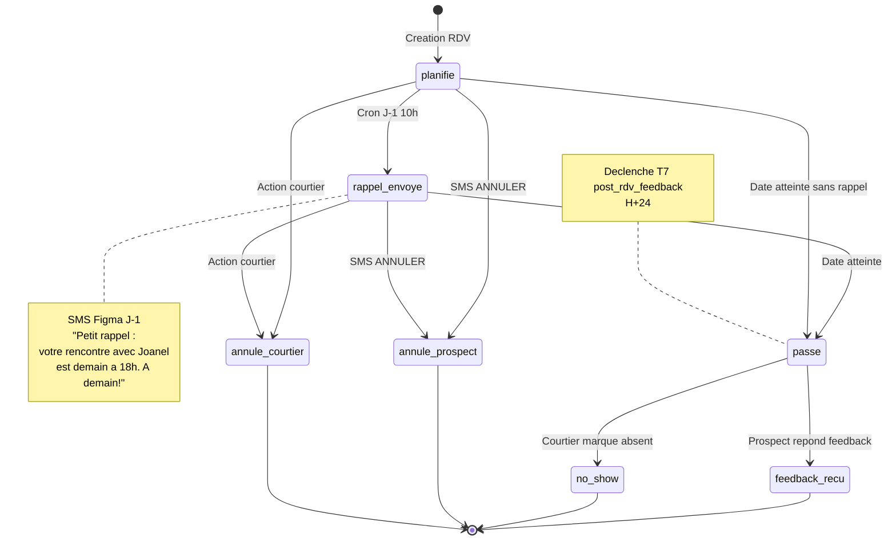

# Spécification — Table `rendez_vous`

> **Contexte :** Cette table n'existe pas encore dans le schéma NextMove MVP.
> Elle est **bloquante** pour le trigger de relance T6 (`rdv_confirmation`) et T7 (`post_rdv_feedback`).
> **À créer en Sprint 2 avant d'implémenter les relances RDV.**

---

## 1. Questions préalables (à valider avec Joanel)

Avant de figer la structure, 4 décisions sont nécessaires :

| # | Question | Options | Impact |
|---|----------|---------|--------|
| **Q1** | **Source du RDV** | (a) Saisie manuelle courtier dans NextMove<br>(b) Import Google Calendar du courtier<br>(c) Créé via n8n depuis SMS ("RDV mardi 15h")<br>(d) Combinaison | Définit les champs `source` + intégrations à bâtir |
| **Q2** | **Type de RDV** | (a) Visite bien uniquement<br>(b) Visite + entretien découverte + signature<br>(c) Typologie libre | Définit l'enum `type_rdv` |
| **Q3** | **Lieu** | (a) Toujours un bien référencé (`bien_id`)<br>(b) Peut être virtuel / bureau courtier / autre<br>(c) Adresse libre | Définit champs `lieu_type` + `adresse` |
| **Q4** | **Multi-participants** | (a) 1 prospect + 1 courtier seulement<br>(b) Peut inclure co-acheteurs (famille)<br>(c) Multi-prospects possible (visite groupée) | Définit relations N:N vs 1:1 |

**Hypothèses par défaut** si non répondu en workshop :
- Q1 = (d) combinaison (saisie manuelle + import Google Calendar futur)
- Q2 = (b) typologie fermée (visite, découverte, signature, relance)
- Q3 = (c) adresse libre (flexibilité maximale)
- Q4 = (a) 1 prospect + 1 courtier pour MVP

---

## 2. Schéma proposé (sous ces hypothèses)

```sql
-- ============================================================
-- TABLE rendez_vous
-- ============================================================

CREATE TYPE rdv_status AS ENUM (
  'planifie',        -- Créé, pas encore confirmé
  'confirme',        -- Prospect a confirmé
  'rappel_envoye',   -- Rappel H-48 envoyé (flag technique)
  'passe',           -- Date passée, en attente feedback
  'feedback_recu',   -- Post-RDV feedback collecté
  'annule_prospect', -- Annulé par le prospect
  'annule_courtier', -- Annulé par le courtier
  'no_show'          -- Prospect absent sans prévenir
);

CREATE TYPE rdv_type AS ENUM (
  'visite_bien',      -- Visite d'une propriété
  'decouverte',       -- Entretien de découverte initial
  'signature',        -- Signature documents / promesse d'achat
  'suivi',            -- Point d'étape / financement
  'virtuel'           -- Visio (découverte / suivi)
);

CREATE TYPE rdv_source AS ENUM (
  'courtier_manuel',  -- Saisi par le courtier dans l'interface
  'n8n_sms',          -- Extrait par Claude d'un échange SMS
  'google_calendar',  -- Importé depuis Google Calendar du courtier
  'api_externe'       -- Autre intégration (Post-MVP)
);

CREATE TABLE rendez_vous (
  id              UUID PRIMARY KEY DEFAULT gen_random_uuid(),
  prospect_id     UUID NOT NULL REFERENCES prospects(id) ON DELETE CASCADE,
  courtier_id    UUID NOT NULL REFERENCES courtiers(id) ON DELETE CASCADE,

  -- Typologie & état
  type_rdv        rdv_type NOT NULL DEFAULT 'visite_bien',
  status          rdv_status NOT NULL DEFAULT 'planifie',
  source          rdv_source NOT NULL DEFAULT 'courtier_manuel',

  -- Planification
  scheduled_at    TIMESTAMPTZ NOT NULL,           -- Date/heure du RDV
  duration_min    INT DEFAULT 60,                 -- Durée estimée
  timezone        TEXT DEFAULT 'America/Montreal',

  -- Lieu (flexible : adresse libre OU référence bien)
  lieu_type       TEXT CHECK (lieu_type IN ('bien', 'bureau', 'virtuel', 'autre')) DEFAULT 'autre',
  adresse         TEXT,                           -- Adresse libre
  bien_id         UUID,                           -- FK optionnelle (table biens, Post-MVP)
  meeting_url     TEXT,                           -- Si virtuel (Google Meet, Zoom, etc.)

  -- Confirmation & rappels (flags techniques pour relances)
  confirmation_requested_at  TIMESTAMPTZ,         -- Quand on a demandé la confirmation
  confirmed_at                TIMESTAMPTZ,         -- Quand prospect a confirmé
  rappel_h48_sent_at          TIMESTAMPTZ,         -- Relance H-48 envoyée
  rappel_h24_sent_at          TIMESTAMPTZ,         -- Relance H-24 envoyée (si H-48 sans réponse)
  feedback_requested_at       TIMESTAMPTZ,         -- Post-RDV feedback demandé

  -- Intégration externe (Google Calendar)
  external_calendar_id        TEXT,                -- ID Google Calendar
  external_event_id           TEXT,                -- ID événement Google
  last_synced_at              TIMESTAMPTZ,

  -- Métadonnées
  notes           TEXT,                           -- Notes libres courtier
  created_at      TIMESTAMPTZ DEFAULT NOW(),
  updated_at      TIMESTAMPTZ DEFAULT NOW(),
  created_by      TEXT NOT NULL,                  -- 'courtier' | 'n8n-service' | 'google-sync'

  -- Contraintes
  CONSTRAINT valid_scheduled_future CHECK (scheduled_at > created_at - INTERVAL '1 hour'),
  CONSTRAINT feedback_requires_past CHECK (
    feedback_requested_at IS NULL OR feedback_requested_at >= scheduled_at
  )
);

-- ============================================================
-- INDEXES
-- ============================================================

-- Queries par courtier (dashboard courtier)
CREATE INDEX idx_rendez_vous_courtier_date
  ON rendez_vous (courtier_id, scheduled_at DESC);

-- Queries du scheduler relances (cron 15min)
CREATE INDEX idx_rendez_vous_status_scheduled
  ON rendez_vous (status, scheduled_at)
  WHERE status IN ('planifie', 'confirme');

-- Queries pour post-RDV feedback
CREATE INDEX idx_rendez_vous_feedback_pending
  ON rendez_vous (scheduled_at)
  WHERE status = 'passe' AND feedback_requested_at IS NULL;

-- ============================================================
-- ROW LEVEL SECURITY
-- ============================================================

ALTER TABLE rendez_vous ENABLE ROW LEVEL SECURITY;

-- Courtiers voient uniquement leurs propres RDV
CREATE POLICY "courtiers_own_rdv" ON rendez_vous
  FOR ALL
  TO authenticated
  USING (courtier_id = auth.uid());

-- n8n (service_role) : accès complet mais respecte ownership
CREATE POLICY "n8n_service_access" ON rendez_vous
  FOR ALL
  TO service_role
  USING (true);

-- Anonymes : aucun accès
-- (pas de policy = bloqué par défaut)

-- ============================================================
-- TRIGGERS
-- ============================================================

-- Trigger : mise à jour automatique de updated_at
CREATE OR REPLACE FUNCTION update_rendez_vous_updated_at()
RETURNS TRIGGER AS $$
BEGIN
  NEW.updated_at = NOW();
  RETURN NEW;
END;
$$ LANGUAGE plpgsql;

CREATE TRIGGER trg_rendez_vous_updated_at
  BEFORE UPDATE ON rendez_vous
  FOR EACH ROW
  EXECUTE FUNCTION update_rendez_vous_updated_at();

-- Trigger : passage automatique en status 'passe' quand date atteinte
-- (exécuté par le scheduler cron, pas par la DB directement)
```

---

## 2bis. Diagramme d'état d'un RDV



---

## 3. Relations avec le système de relance

### Trigger T6 (`rdv_confirmation`) — Comment il fonctionne

```
Scheduler cron (15 min) :
  SELECT id, prospect_id, courtier_id, scheduled_at
  FROM rendez_vous
  WHERE status = 'planifie'
    AND scheduled_at BETWEEN NOW() + INTERVAL '46 hours'
                          AND NOW() + INTERVAL '50 hours'
    AND rappel_h48_sent_at IS NULL;

→ Pour chaque RDV :
  1. Vérifier can_send_relance(prospect_id, 'rdv_confirmation')
  2. Si OK : envoyer SMS confirmation
  3. UPDATE rendez_vous SET rappel_h48_sent_at = NOW()
  4. Si prospect répond OUI dans 24h → UPDATE status = 'confirme'
  5. Sinon H-24 → relance 2/2 (rappel_h24_sent_at)
```

### Trigger T7 (`post_rdv_feedback`) — Comment il fonctionne

```
Scheduler cron (15 min) :
  SELECT id, prospect_id, courtier_id
  FROM rendez_vous
  WHERE status IN ('confirme', 'planifie', 'rappel_envoye')
    AND scheduled_at BETWEEN NOW() - INTERVAL '26 hours'
                          AND NOW() - INTERVAL '22 hours'
    AND feedback_requested_at IS NULL;

→ Pour chaque RDV :
  1. UPDATE status = 'passe' (automatique)
  2. Vérifier can_send_relance(prospect_id, 'post_rdv_feedback')
  3. Si OK : envoyer SMS feedback
  4. UPDATE rendez_vous SET feedback_requested_at = NOW()
  5. Réponse prospect → status = 'feedback_recu'
```

### Gestion du no-show

```
Scheduler cron (quotidien, 22h) :
  SELECT id FROM rendez_vous
  WHERE scheduled_at < NOW() - INTERVAL '4 hours'
    AND status IN ('planifie', 'confirme', 'rappel_envoye')
    AND feedback_requested_at IS NULL;

→ Notifier le courtier : "Le RDV de 14h avec [prospect] n'a pas été marqué comme effectué.
                        Le prospect s'est-il présenté ?"
→ Courtier marque : 'passe' (OK) | 'no_show' (absent) | 'annule_prospect'
```

---

## 4. Questions résiduelles

- **Intégration Google Calendar** : Sprint 2 ou Sprint 3 ? (Effort ~2j incluant OAuth + sync)
- **Conflits d'agenda** : faut-il bloquer la création si le courtier a déjà un RDV à la même heure ? (Recommandation : warning, pas block)
- **Rappels au courtier** : le courtier reçoit-il aussi des rappels de ses propres RDV ? (Recommandation : oui via notif push, optionnel)
- **Annulation** : qui peut annuler ? Prospect via SMS "ANNULER" ? Courtier via interface ? Les deux ?

---

## 5. Migration SQL (prête à appliquer)

**Fichier :** `supabase/migrations/00X_create_rendez_vous.sql`

```sql
BEGIN;

-- Créer les enums
CREATE TYPE rdv_status AS ENUM (...);  -- voir section 2
CREATE TYPE rdv_type AS ENUM (...);
CREATE TYPE rdv_source AS ENUM (...);

-- Créer la table
CREATE TABLE rendez_vous (...);

-- Indexes
CREATE INDEX ...;

-- RLS
ALTER TABLE rendez_vous ENABLE ROW LEVEL SECURITY;
CREATE POLICY ...;

-- Triggers
CREATE OR REPLACE FUNCTION update_rendez_vous_updated_at() ...;
CREATE TRIGGER trg_rendez_vous_updated_at ...;

-- Seed données test (optionnel)
-- INSERT INTO rendez_vous (...) VALUES (...);

COMMIT;
```

---

## 6. Décisions à valider en workshop

| # | Question | Hypothèse proposée | Validé ? |
|---|----------|-------------------|----------|
| 1 | Source principale des RDV | Saisie manuelle MVP + Google Calendar Sprint 3 | ☐ |
| 2 | Types de RDV | 5 types fermés (visite, découverte, signature, suivi, virtuel) | ☐ |
| 3 | Lieu flexible | Oui, adresse libre + bien_id optionnel | ☐ |
| 4 | Multi-participants | 1 prospect + 1 courtier (MVP) | ☐ |
| 5 | Gestion no-show | Courtier marque manuellement à J+1 | ☐ |
| 6 | Annulation par SMS | "ANNULER" reconnu par Claude ? | ☐ |
| 7 | Conflits agenda courtier | Warning seulement (pas block) | ☐ |
| 8 | Rappels courtier | Notif push H-2 optionnelle | ☐ |

---

*Document rédigé par l'équipe architecture NextMove — V1 2026-04-17*
