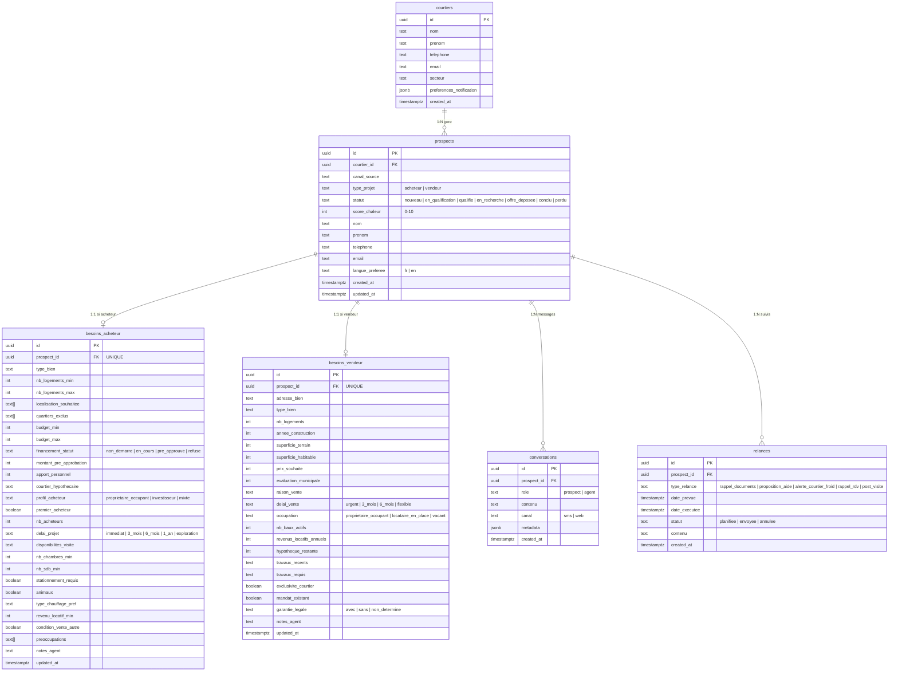
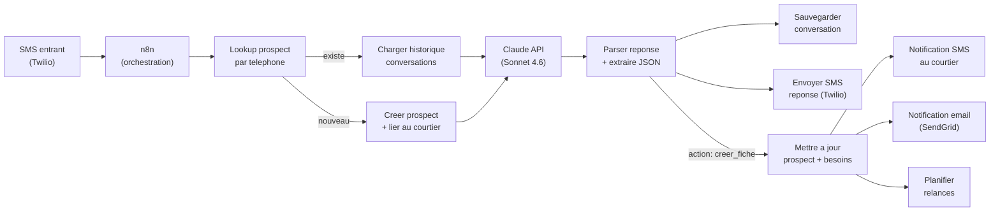
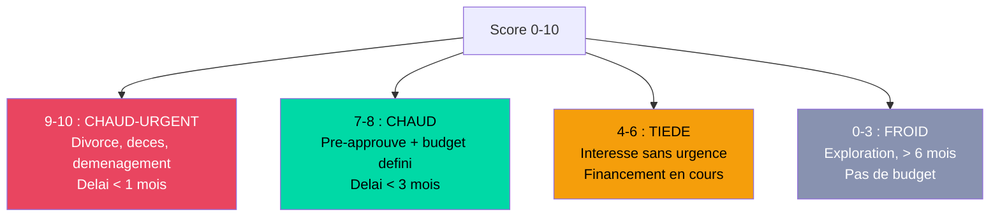
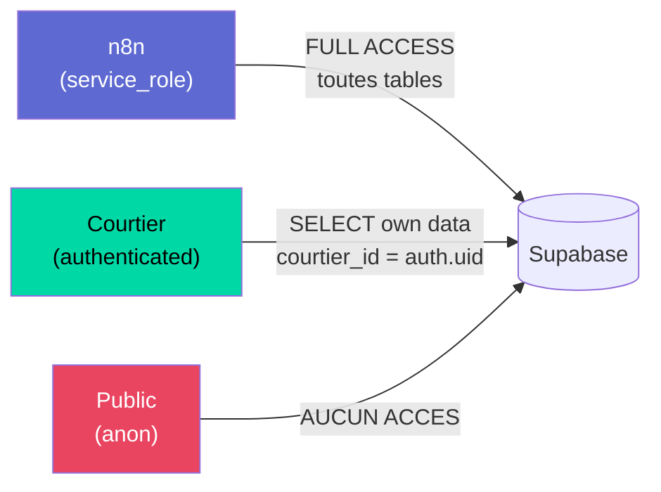

# Schema Supabase — NextMove MVP

**6 tables | ca-central-1 | RLS enabled | Multi-tenant**

## Diagramme Entite-Relation

## Flux de donnees

## Score chaleur

## Grille de scoring (Dennis)

| Critere | Points |
|---------|--------|
| Financement pre-approuve | +3 |
| Delai < 3 mois | +2 |
| Budget defini | +2 |
| Secteur precise | +1 |
| Premier acheteur | +1 |
| Mise de fonds disponible | +1 |

**7-10 = Chaud | 4-6 = Tiede | 0-3 = Froid**

## RLS (Row Level Security)

**Regles :**
- `service_role` (n8n) : acces complet a tout (lecture + ecriture)
- `authenticated` (courtier connecte) : voit seulement SES prospects, SES conversations, SES relances
- `anon` : aucun acces

## Comparaison avec le PRD

| Aspect PRD | Schema Dennis | Alignement |
|-----------|--------------|------------|
| FR-4.1 Fiche client 17 champs | besoins_acheteur 28 cols + besoins_vendeur 23 cols | Depasse les exigences |
| FR-4.2 Score 4 niveaux texte | Integer 0-10 avec grille de scoring | Different mais plus flexible |
| FR-4.3 Reconnaissance numero | Lookup par telephone dans prospects | Aligne |
| NFR-3.1 Donnees au Canada | Supabase ca-central-1 | Aligne |
| NFR-5.3 Multi-tenant | courtier_id FK + RLS | Aligne (V1 ready) |
| FR-8.5 Courtier corrige fiche | UPDATE via authenticated + RLS | Aligne |

## Tables absentes (Sprint 2)

| Table | Prevue pour | Usage |
|-------|------------|-------|
| `rendez_vous` | Sprint 2 | Planification visites + Google Calendar |
| `blacklist` | Sprint 1 (a ajouter) | Numeros STOP / bloques (obligation legale) |
